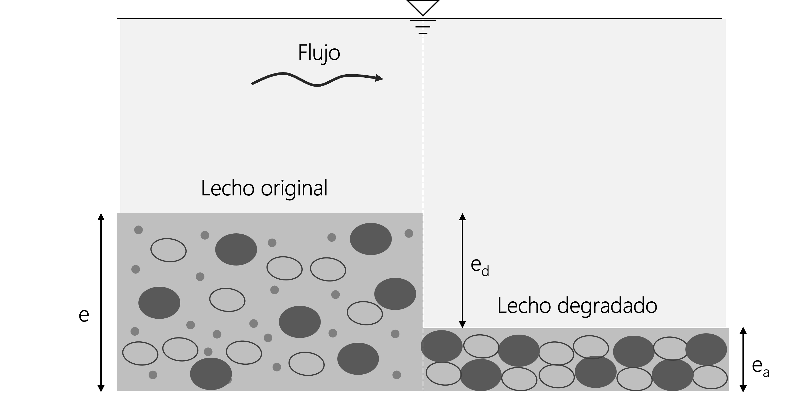
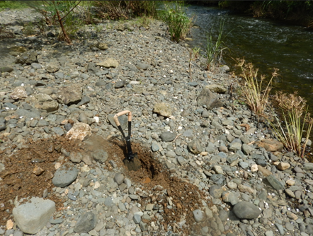
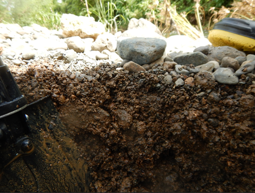

<b> Universidad Escuela Colombiana de Ingeniería Julio Garavito</b>
 
María Fernanda Latouche Facenda
 
Profesora del Centro de Estudios Hidráulicos
 
maria.latouche@escuelaing.edu.co

## Módulo 1 - Actividad 5. Acorazamiento
Keywords: `Bed sorting` `Armoring` 

    

### Acorazamiento de un cauce

Los cauces compuestos de material bien gradado tienden a desarrollar una coraza o armadura en la superficie del lecho. Este proceso de *acorazamiento* ocurre debido a que la granulometría del lecho no es uniforme, por lo tanto, se transportarán primero y a una mayor tasa, las partículas más finas que las partículas más gruesas, las cuales pueden soportar mayores esfuerzos cortantes. De esta forma, debido a la permanencia de las partículas de sedimento más gruesas, se va formando una especie de coraza en la superficie del lecho, que protege el material más fino ubicado debajo de esta capa, limitando su erosión [^1] [^2].

En la siguiente figura se presenta un esquema del acorazamiento de un lecho, en donde el lecho original va siendo degradado hasta que se forma en el lecho una capa compuesta del material más grueso.

  

> Figura adaptada de: Rodríguez Díaz, H. A. (2010)[^1]

Donde:

$e$ = Espesor total inicial del lecho antes del proceso de acorazamiento

$e_{a}$ = Espesor de la capa acorazada

$e_{d}$ = Profundidad de degradación

El espesor de la capa acorazada varía con el tamaño del material de acorazamiento, por lo general, el espesor es dos o tres veces el tamaño de este material y normalmente no supera los 15 cm[^1].

En las siguientes fotos se puede observar un ejemplo del acorazamiento de un lecho, en donde el material de la superficie del lecho del Río De La Plata es mucho más grueso que el material subsuperficial.

  
  

> Fuente: Hydrologic Engineering Center[^3]

### Licencia, cláusulas y condiciones de uso

M.TSED es de uso libre para fines académicos, conoce nuestra licencia, cláusulas, condiciones de uso y como referenciar los contenidos publicados en este repositorio, dando [clic aquí](https://github.com/mflatouche/M.TSED/wiki/License).

| [Anterior](../1_MovimientoIncipiente) | [:house: Inicio](../../README.md) | [:beginner: Ayuda](https://github.com/mflatouche/M.TSED/discussions/5)  | [Siguiente](../1_CaudalSuspension) |
|------------------|-----------------------------------------------------------|------------------------------------------------------------------------|-------------------|

[^1]: Rodríguez Díaz, H. A. (2010). _Hidráulica Fluvial. Fundamentos y aplicaciones. Socavación_. Colombia: Editorial Escuela Colombiana de Ingeniería.
[^2]: Instituto de Ingeniería UNAM. (1999). _Manual de Ingeniería de Ríos_. México: Universidad Autónoma de México.
[^3]: Hydrologic Engineering Center. (s.f.). Hydrologic Engineering Center's (CEIWR-HEC) River Analysis System (HEC-RAS). Obtenido de 1D Sediment Transport Technical Reference Manual: https://www.hec.usace.army.mil/confluence/rasdocs/rassed1d/1d-sediment-transport-technical-reference-manual

##

 Este curso guía ha sido desarrollado con el apoyo de la Universidad Escuela Colombiana de Ingeniería Julio Garavito. Encuentra más contenidos en https://github.com/uescuelaing  
