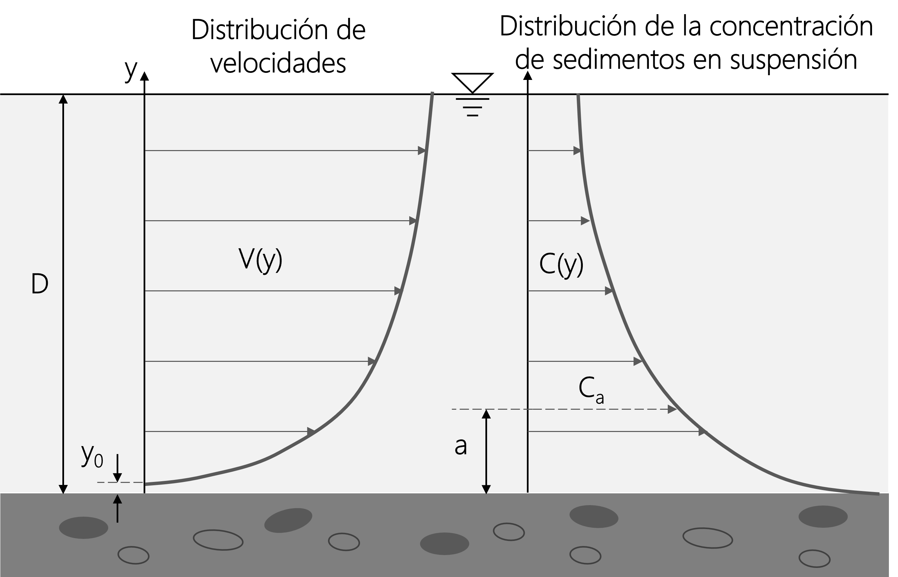

## Caudal sólido en suspensión
Keywords: `Suspended load` `Rouse equation`

    

### Distribución de velocidades y de concentración de material sólido suspendido

El **caudal sólido $(Q_{S})$** es el volumen de sedimentos por unidad de tiempo que cruza una sección transversal del cauce y el **caudal sólido unitario $(q_{S})$** es el caudal sólido por unidad de ancho. El caudal sólido también puede ser expresado en peso por unidad de tiempo. Es preferible utilizar el peso porque las medidas realizadas en campo para determinar el caudal sólido en suspensión son la velocidad de la corriente y las concentraciones de material sólido suspendido, las cuales generalmente se expresan en $[mg/l]$ o en $[p.p.m]$. Ambas variables tienen una distribución en la vertical predecible[^1].

La distribución de velocidades en un flujo turbulento en canales a superficie libre, de acuerdo con la teoría de la capa límite, tiene una distribución logarítmica[^2]:

$V(y)=2.5 Ln\left ( \frac{y}{y_{0}} \right )U_{*}$

Donde:

$V(y)$ = Velocidad del flujo a una distancia "y" del fondo del canal $[m]$

$y_{0}=\frac{\varepsilon }{30}$ $[m]$

$\varepsilon$ = Rugosidad $[m]$

$U_{\*}$ = Velocidad de corte $[m/s]$

La distribución de concentraciones de sedimentos en suspensión, en primera aproximación, tiene una distribución exponencial. Rouse (1937) propuso una ecuación para evaluar la variación vertical de la concentración de sedimentos en suspensión si se conoce la concentración de sedimentos $C_{a}$ a una distancia $a$ sobre el fondo [^1]:

$\frac{C(y)}{C_{a}}=\left [ \left ( \frac{D-y}{y} \right )\left ( \frac{a}D-a{} \right ) \right ]^{\frac{\omega }{k U_{*}}}$

Donde:

$C(y)$ = Concentración de sedimentos en suspensión a una distancia "y" del fondo del canal $[mg/l]$

$C_{a}$ = Concentración de sedimentos en suspensión conocida a una distancia "a" del fondo del canal $[mg/l]$

$D$ = Profundidad de la lámina de agua $[m]$

$U_{\*}$ = Velocidad de corte $[m/s]$

$\omega$ = Velocidad de caída de las partículas $[m/s]$

$k$ = Constante de von-Karman, se considera igual a 0.4

  

El caudal sólido en suspensión unitario es la integración en la vertical del producto de la de la velocidad por la concentración $\int_{0}^{D}C(y)V(y)dy$ y se expresa en $[kg-m/s]$. Las mayores concentraciones de material en suspensión conocidas son del orden de 100 g/l en grandes ríos en China (una concentración de 1 g/l ya es considerada extraordinariamente elevada), y las menores son del orden de 1 mg/l en ríos de países europeos[^3].

### Licencia, cláusulas y condiciones de uso

M.TSED es de uso libre para fines académicos, conoce nuestra licencia, cláusulas, condiciones de uso y como referenciar los contenidos publicados en este repositorio, dando [clic aquí](https://github.com/mflatouche/M.TSED/wiki/License).

| [Anterior](../1_Acorazamiento) | [:house: Inicio](../../README.md) | [:beginner: Ayuda](https://github.com/mflatouche/M.TSED/discussions/6)  | [Siguiente](../1_Lane) |
|------------------|-----------------------------------------------------------|------------------------------------------------------------------------|-------------------|

[^1]: Camargo, J., & Franco, V. (1999). _Manual de Ingeniería de Ríos_. México: Universidad Autónoma de México Instituto de Ingeniería.
[^2]: Rodríguez Díaz, H. A. (2010). _Hidráulica Fluvial. Fundamentos y aplicaciones. Socavación_. Colombia: Editorial Escuela Colombiana de Ingeniería.
[^3]: Martín V., J. P. (2009). _Ingeniería de ríos_. Barcelona: Univ. Politèc. de Catalunya.

