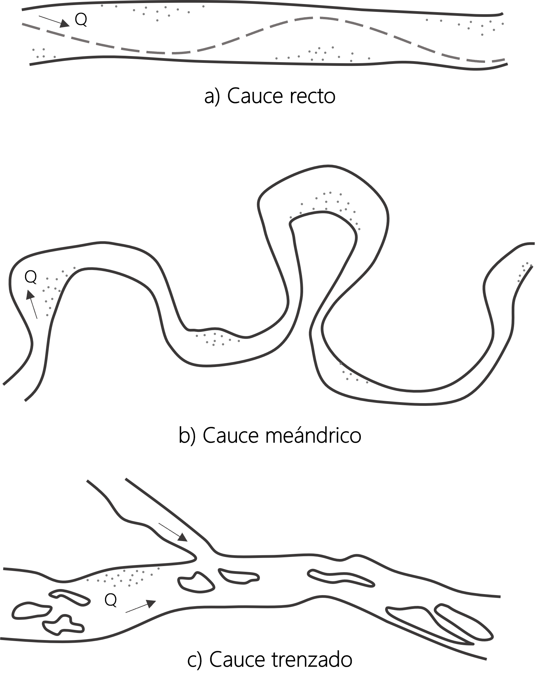

## Morfología de cauces
Keywords: `Clasificación ríos` `Schumm` 

    

### Clasificación básica de los ríos

Según la libertad de ajustar su forma y su pendiente motriz los cauces se pueden clasificar en dos grandes grupos[^1]:
* **Cauces de lecho rocoso**: suelen ser ríos encajados en los valles, confinados entre afloramientos rocosos. El material que compone el fondo y las márgenes es el que determina la morfología del cauce[^1].
* **Cauces aluviales**: son aquellos en los que las márgenes y el fondo están constituidos por materiales sedimentarios modernos, generalmente aportados por el mismo río[^2]. Estos tipos de cauces tienen la libertad de ajustar sus dimensiones, forma y pendiente como respuesta a los cambios que se produzcan[^1].

En los cauces aluviales, es muy común que estos materiales ocupen una extensión horizontal mayor que la del cauce actual, formando lo que se conoce como "llanuras de inundación"[^2]. En la ingeniería fluvial los problemas más importantes están asociados a este tipo de cauces debido a que frecuentemente, en sus valles aluviales se asienta la mayor densidad de actividades humanas[^2].

### Patrones de cauces

 Los patrones de los cauces pueden ser clasificados básicamente en tres tipos: rectos, meándricos y trenzados. Por lo general, los cauces rectos son de carga por arrastre, los meándricos son de carga en suspensión o mixta y los trenzados son de carga por arrastre que en aguas bajas forman islas de sedimentos[^1].

  

* **Cauces rectos**: estos tipos de cauces son poco comunes en la naturaleza y se presentan normalmente en tramos cortos[1]. Son transitorios, ya que cualquier irregularidad en la forma del cauce o del alineamiento origina disturbios locales que producen flujos tranversales, generando curvas y meandros[^3].
* **Cauces meándricos**: son aquellos cauces que presentan curvas alternadas unidas por tramos rectos y cortos[^3]. Los cauces meándricos son inestables, presentando erosión en las márgenes exteriores de las curvas y sedimentación en las márgenes interiores. Normalmente, estos cauces poseen una pendiente relativamente baja[^3].
* **Cauces trenzados**: están compuestos por múltiples cauces menores entrelazados, que forman islas entre sí al unirse y separarse[^2]. Cuando hay caudales bajos, existen dos o más cauces principales entrelazados; en las crecientes la mayoría de las islas son inundadas[^4]. Estos cauces normalmente poseen una pendiente relativamente alta y su presencia se asocia a una gran capacidad de transporte sólido.

### Clasificación de cauces aluviales

En general, los tramos de los ríos pueden estar en equilibrio o sujetos a procesos de erosión o sedimentación[^3]. Schumm (1963) propuso una clasificación de los cauces aluviales basada en la carga de sedimentos debido a su influencia en la estabilidad del cauce, forma y sinuosidad[^4]. Establece tres tipos de cauces: estable, con sedimentación y con erosión; y a su vez, tres subclases con base en el modo predominante del transporte de sedimentos: carga por arrastre, carga mixta y carga en suspensión[^1].

En la siguiente tabla se muestra la clasificación de cauces según Schumm:

| Modo de transporte de sedimentos                                        | M%  | Estable                                                                        | En sedimentación (exceso de sedimentos)                                                                                     | En erosión (déficit de sedimentos)                                          |
|-------------------------------------------------------------------------|-----|--------------------------------------------------------------------------------|-----------------------------------------------------------------------------------------------------------------------------|-----------------------------------------------------------------------------|
| Carga suspendida: carga del 85-100%                                     | 100 | Relación ancho/profundidad <7; Sinuosidad >2.1; Pendiente: relativamente baja  | La mayor sedimentación ocurre en las márgenes, que causa el estrachamiento del cauce. La sedimentación en el lecho es poca. | Predomina la erosión del fondo del lecho. Poco ensanchamiento del cauce.    |
| Carga mixta: carga suspendida del 65-85%, carga por arrastre del 15-35% | 30  | Relación ancho/profundidad 7-25; Sinuosidad 1.5-2.1; Pendiente: moderada       | Al comienzo hay mayor sedimentación en las márgenes y luego se presenta sedimentación en el lecho.                          | Comienza por erosión del fondo del lecho, seguido por ampliación del cauce. |
| Carga por arrastre: carga del 35-70%                                    | 0   | Relación ancho/profundidad >25; Sinuosidad <1.5; Pendiente: relativamente alta | Sedimentación en el lecho y formación de islas.                                                                             | Poca erosión del fondo, predomina el ensanchamiento del cauce.              |

M= porcentaje de limo-arcilla en el perímetro del canal

> Clasificación de cauces aluviales de Schumm. Fuente: Schumm, S. A. (1977) [^5]

### Licencia, cláusulas y condiciones de uso

M.TSED es de uso libre para fines académicos, conoce nuestra licencia, cláusulas, condiciones de uso y como referenciar los contenidos publicados en este repositorio, dando [clic aquí](https://github.com/mflatouche/M.TSED/wiki/License).

| [Anterior]() | [:house: Inicio](../../README.md) | [:beginner: Ayuda]()  | [Siguiente]() |
|---------------------------------------------------------------------------------|---------------------------------------------------------|------------------------------------------------------------------------|-----------------------------------------------------------------------------------|

[^1]: Rodríguez Díaz, H. A. (2010). _Hidráulica Fluvial. Fundamentos y aplicaciones. Socavación_. Colombia: Editorial Escuela Colombiana de Ingeniería.
[^2]: Martín V., J. P. (2009). _Ingeniería de ríos_. Barcelona: Univ. Politèc. de Catalunya.
[^3]: Camargo, J., & Franco, V. (1999). _Manual de Ingeniería de Ríos_. México: Universidad Autónoma de México Instituto de Ingeniería.
[^4]: Petersen, M. (1986). River Engineering. Arizona: Prentice-Hall.
[^5]: Schumm, S. A. (1977). The Fluvial System. Nueva York: John Wiley & Sons.

