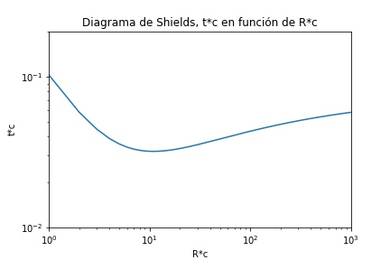

## Movimiento incipiente
Keywords: `Shear stress` `Shields` `Incipient motion`

<div align="center">
    <a href="">
        
    </a>
</div>

### Estudio del movimiento incipiente

Para el estudio del transporte de sedimentos, es necesario analizar el comienzo del movimiento de las partículas o _movimiento incipiente_. Si se supone una partícula de sedimento de forma esférica sobre el fondo del lecho de un cauce aluvial, con una pendiente longitudinal muy pequeña tal que se pueda despreciar la componente del peso en la dirección del movimiento, se presentan las siguientes fuerzas actuando sobre la partícula[^1].

$F_{L}$ = Fuerza ascensional, producida por las componentes verticales de la velocidad

$F_{D}$ = Fuerza de arrastre, producida por las componentes horizontales de la velocidad

$W_{S}$ = Peso sumergido de la partícula

$F_{R}$ = Fuerza de resistencia, producida entre la frontera fija y las partículas en movimiento

<div align="center">
  
</div>

Cuando la partícula se encuentra en estado de movimiento incipiente se cumple algunas de estas condiciones:

<div align="center">

  $F_{L}=W_{S}$
  
  $F_{D}=F_{R}$
  
  $M_{0}=M_{R}$
</div>

Donde:

$M_{0}$ = Momento del movimiento producido por  $F_{D}$ y $F_{R}$ 

$M_{R}$ = Momento resistente al movimiento debido a $F_{L}$ y $W_{S}$ 

La determinación del movimiento incipiente de las partículas o la condición _crítica_ de arrastre es de gran importancia en la ingeniería fluvial, debido a que permite inferir las condiciones que originarían el transporte de partículas del material del lecho o las condiciones que favorecerían su deposición[^2]. Los criterios más utilizados para determinar el movimiento incipiente toman como referencia los esfuerzos cortantes.

### Aproximación de esfuerzos cortantes

#### Aproximación de Shields
El arrastre de materiales no cohesivos con granulometría uniforme se ha estudiado desde hace varios siglos[^2], para esto se han efectuado muchos experimentos de laboratorio, entre los que destacan los resultados presentados por Shields[^1].

Shields realizó sus experimentos en un canal de laboratorio utilizando flujo turbulento completamente desarrollado y materiales con distintas densidades, pero con granulometría uniforme, partiendo siempre de la condición de fondo plano y considerando como condición crítica de arrastre aquella en la que existe movimiento generalizado de las partículas, pero el transporte de ellas o el _caudal sólido_ es muy pequeño y el fondo permanece plano[^2]. 

Los resultados de sus experimentos los presentó en el "Diagrama de Shields" como función de dos parámetros adimensionales:

<div align="center">

$\tau_{*}=\frac{\tau_{0}}{(\gamma_{s}-\gamma)d}$   y   $R_{\*}=\frac{U_{\*} d}{\nu}$
</div>

Donde:

$\tau_{\*}$ = Esfuerzo cortante adimensional $[adimensional]$

$R_{\*}$ = Número de Reynolds de corte $[adimensional]$

$\tau_{0}$ = Esfuerzo cortante en el lecho $[N/m^{2}]$

$d$ = Diámetro característico de las partículas $[m]$

$\gamma_{s}$ = Peso específico de las partículas $[N/m^{3}]$

$\gamma$ = Peso específico del agua $[N/m^{3}]$

$\nu$ = Viscosidad cinemática del agua $[m^{2}/s]$

$U_{\*}$ = Velocidad de corte $[m/s]$

La velocidad de corte se define como:

<div align="center">

  $U_{*}=\sqrt{\frac{\tau_{0}}{\rho}}$   y   $\tau_{0}=\gamma R S_{0}$
</div>

Donde:

$\rho$ = Densidad del fluido $[kg/m^{3}]$

$R$ = Radio hidráulico $[m]$

$S_{0}$ = Pendiente del fondo del canal $[m/m]$


Las fuerzas promotoras del movimiento están representadas como $\tau_{0}d^{2}$ y explican la acción del agua sobre el fondo. Estas fuerzas son contrarrestadas por la resistencia de las partículas que conforman el lecho (particularmente con su peso sumergido) la cual se puede expresar como $(\gamma_{s}-\gamma)d^{3}$. El primer parámetro de Shields, $\tau_{\*}$, denominado esfuerzo cortante crítico adimensional, relaciona las fuerzas causantes del movimiento con las fuerzas que se oponen a dicho movimiento. Este parámetro corresponde a las ordenadas del diagrama de Shields. Si se expresa $\tau_{0}$ en función de la velocidad de corte $U_{\*}$, el parámetro presenta la misma estructura de un número de Froude[^1].

El segundo parámetro, graficado en las abscisas, se denomina número de Reynolds de corte, $R_{\*}$. Este número de Reynolds utiliza la velocidad de corte como la velocidad significativa, el diámetro característico de las partículas y la viscosidad cinemática[^1]. Al relacionar estos dos parámetros, experimentalmente se estableció una curva que representa la condición crítica de arrastre o de movimiento incipiente, en donde $\tau_{0}=\tau_{c}$. La zona por encima de esta curva, corresponde a situaciones en las que las partículas del cauce son transportadas por el flujo (hay movimiento del material del lecho), y, por el contrario, en la zona debajo de la curva no existe movimiento[^2].

<div align="center">
  
</div>

> Diagrama de Shields. Fuente: Instituto de Ingeniería UNAM. (1999)[^2]

En la condición crítica de arrastre, el esfuerzo cortante crítico aparece en los dos parámetros adimensionales, por lo que para determinar $\tau_{c}$ se debe realizar un proceso iterativo. Si se eleva al cuadrado el parámetro $R_{*c}$ y se divide entre el valor de $\tau_{*c}$, al simplificar este valor se obtiene un parámetro adimensional que no contiene la variable $\tau_{c}$ y para no obtener cocientes demasiado grandes, al parámetro adimensional se le extrae la raíz cúbica[^2]:

<div align="center">

  $D_{\*c}=\left (\frac{R_{\*c}^{2}}{\tau _{*c}}  \right )^{1/3}=d\left (\frac{\left (\gamma_{s}-\gamma  \right )}{\gamma}\frac{g}{\nu^{2}}  \right )^{1/3}$
</div>

La relación entre $\tau_{\*c}$ y $D_{\*c}$ permite determinar directamente el valor de $\tau_{c}$.

<div align="center">
  
</div>

> Diagrama de Shields, $D_{\*c}$ vs $\tau_{\*c}$. Fuente: Instituto de Ingeniería UNAM. (1999)[^2]

#### Ecuaciones de Maza

Maza encontró una ecuación que representa la curva del diagrama de Shields en función del Número de Reynolds de corte[^2]:

<div align="center">
  Si $1\leq R_{*c}\leq 1500$ entonces $\tau_{*c}=\frac{0.097}{R_{*c}}+0.077 exp\left \{- (\frac{19.58}{R_{*c}})^{0.3191} \right \}$
  <br>
  Si $R_{*c}> 1500$ entonces $\tau_{*c}=0.06$
</div>
<br>
Se definió una función en Python para calcular el esfuerzo cortante adimensional utilizando la ecuación de Maza:

```
def Tc_Rc(Rc):
    if Rc <= 1500:
        T=(0.097/Rc)+0.077*np.exp(-((19.58/Rc)**0.3191))
    else:
        T=0.06
    return T
```
<div align="center">
  
</div>

Maza también propuso una ecuación que representa la curva de movimiento incipiente en función de los parámetros $\tau_{*c}$ y $D_{*c}$ :

<div align="center">
  Si $1\leq D_{*c}\leq 333$ entonces $\tau_{*c}=\frac{0.2196}{D_{*c}}+0.077 exp\left \{- (\frac{30.35}{D_{*c}})^{0.563} \right \}$
  <br>
  Si $D_{*c}> 333$ entonces $\tau_{*c}=0.06$
</div>
<br>
Para esta ecuación también se definió una función en Python para obtener $\tau_{*c}$ en función de $D_{*c}$:

```
def Tc_Dc(Dc):
    if Dc <= 333:
        T=(0.2196/Dc)+0.077*np.exp(-((30.35/Dc)**0.563))
    else:
        T=0.06
    return T
```
<div align="center">
  
</div>

### Actividad resuelta

Un cauce está constituido por arenas de tamaño uniforme y conduce agua clara. La densidad relativa promedio de esas arenas es S=2.677209 y el tamaño de las partículas de arena es d=0.241 mm. Si la temperatura del agua es de 15 °C, calcular el esfuerzo cortante crítico del cauce, según el criterio de Shields y utilizando las ecuaciones propuestas por Maza[^2].

[:open_file_folder: Solución](./ipnyb/Ejemplo_Shields.ipynb)

### Actividad complementaria :pencil2:

Resuelva el problema del ejemplo utilizando el diagrama de Shields en función de $R_{\*c}$  y el diagrama de Shields en función de $D_{\*c}$.

### Licencia, cláusulas y condiciones de uso

M.TSED es de uso libre para fines académicos, conoce nuestra licencia, cláusulas, condiciones de uso y como referenciar los contenidos publicados en este repositorio, dando [clic aquí](https://github.com/mflatouche/M.TSED/wiki/License).

| [Anterior](../1_Potencia) | [:house: Inicio](../../README.md) | [:beginner: Ayuda]()  | [Siguiente](../1_Acorazamiento) |
|------------------|-----------------------------------------------------------|------------------------------------------------------------------------|-------------------|


[^1]: Rodríguez Díaz, H. A. (2010). _Hidráulica Fluvial. Fundamentos y aplicaciones. Socavación_. Colombia: Editorial Escuela Colombiana de Ingeniería.
[^2]: Instituto de Ingeniería UNAM. (1999). Manual de Ingeniería de Ríos. México: Universidad Autónoma de México.
