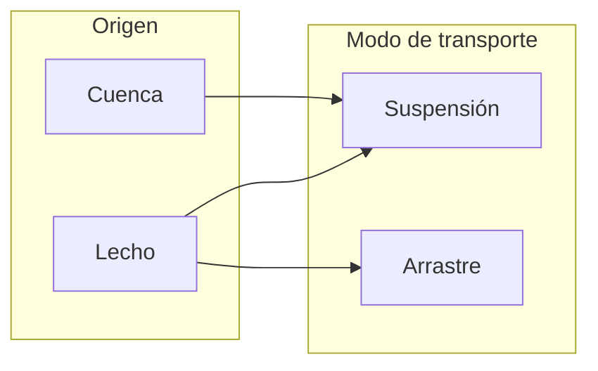

## Transporte de sedimentos 
Keywords: `Sediment transport` 

### Sedimentos
Se entiende por _sedimentos_ a todas las partículas de suelo y roca de una cuenca que son arrastradas y transportadas por una corriente de agua[^1]. Los sedimentos transportados por un cauce pueden provenir de dos fuentes:
* **Cuenca**: generados por la erosión de la superficie del terreno de la cuenca hidrográfica debido a la acción del viento y la lluvia. 
* **Lecho**: generados por la erosión del cauce principal y sus tributarios.

#### Clasificación de los sedimentos según su tamaño
En el siguiente cuadro se presenta la clasificación de los sedimentos según su tamaño con base en la clasificación de Rouse. Se muestra claramente lo que se define como arena, grava, suelos granulares y suelos cohesivos, lo cual es de gran utilidad en el transporte de sedimentos [^2].

| Tipo de suelo | Nombre | Tamaño | Tamiz |
|---|---|---|---|
| _**Suelos granulares**_ |**Canto rodado** |  |  |
|  | Muy grande | 4 m - 2 m |  |
|  | Grande | 2 m - 1 m |  |
|  | Mediano | 1 m - 0.5 m |  |
|  | Pequeño | 0.5 m - 0.25 m |  |
|  | **Guijarro** |  |  |
|  | Grande | 256 mm - 128 mm |  |
|  | Pequeño | 128 mm - 64 mm |  |
|  | **Grava** |  | Pasa el tamiz 3" y es retenido por el tamiz 4 |
|  | Muy gruesa | 64 mm - 32 mm |  |
|  | Gruesa | 32 mm - 16 mm |  |
|  | Mediana | 16 mm - 8 mm |  |
|  | Fina | 8 mm - 4 mm |  |
|  | Muy fina | 4 mm - 2 mm |  |
|  | **Arena** |  | Pasa el tamiz 4 y es retenido por el tamiz 200 |
|  | Muy gruesa | 2 mm - 1 mm |  |
|  | Gruesa | 1 mm - 1/2 mm |  |
|  | Mediana | 1/2 mm - 1/4 mm |  |
|  | Fina | 1/4 mm - 1/8 mm |  |
|  | Muy fina | 1/8 mm - 1/16 mm |  |
| _**Suelos cohesivos**_ | **Limo** |  | Pasa tamiz 200 |
|  | Grueso | 1/16 mm - 1/32 mm |  |
|  | Medio | 1/32 mm - 1/64 mm |  |
|  | Fino | 1/64 mm - 1/128 mm |  |
|  | Muy fino | 1/128 mm - 1/256 mm |  |
|  | **Arcilla** |  | Pasa tamiz 200 |
|  | Gruesa | 1/256 mm - 1/512 mm |  |
|  | Media | 1/512 mm - 1/1024 mm |  |
|  | Fina | 1/1024 mm - 1/2048 mm |  |
|  | Muy fina | 1/2048 mm - 1/4096 mm  |  |

### Modos de transporte de sedimentos
Los sedimentos pueden ser transportados por una corriente principalmente de las siguientes formas [^2]: 
* **Suspensión**: los materiales siguen los mismos movimientos del agua y se desplazan aproximadamente a la misma velocidad, se mantienen en suspensión debido a los remolinos generados por la turbulendia del flujo. En general, se tratan de partículas finas *(limos y arcillas)*, que se depositarán por gravedad sólo cuando el flujo es muy lento o se estanca. Parte del material en suspensión puede ser arcilla coloidal, que puede permanecer en suspensión durante períodos de tiempo muy largos.
* **Arrastre**: el transporte de material por arrastre se realiza por la acción del esfuerzo cortante generado por la corriente sobre las partículas de sedimento. El movimiento de las partículas por arrastre puede ser de rodadura o deslizamiento sobre el lecho del cauce.
* **Saltación**: algunas partículas pueden moverse también sobre el lecho del cauce en *saltación*, el cual es un movimiento de saltos sucesivos discontinuos, se produce cuando una partícula choca con otra, haciendo que rebote hacia arriba y luego caiga de nuevo hacia el lecho. 

[image](https://raw.githubusercontent.com/mflatouche/M.TSED/main/Section01/1_TransporteDeSedimentos/Img/1_1.png)

#### Clasificación del transporte de sedimentos
Los sedimentos provenientes del material del lecho del cauce son transportados a lo largo del río por arrastre, y periódicamente pueden ser transportados en suspensión debido a la turbulencia del flujo. Los sedimentos provenientes de la cuenca son los materiales más finos, y por lo tanto, son transportados únicamente en suspensión.

| [Actividad anterior]() | [Inicio](https://github.com/mflatouche/M.TSED/wiki) | [Actividad siguiente]()  |
|------------------------|----------------------------------------------------|----------------------------------------------------------------------------------------|

[^1]: Camargo, J., & Franco, V. (1999). _Manual de Ingeniería de Ríos_. México: Universidad Autónoma de México Instituto de Ingeniería.
[^2]: Rodríguez Díaz, H. A. (2010). _Hidráulica Fluvial. Fundamentos y aplicaciones. Socavación_. Colombia: Editorial Escuela Colombiana de Ingeniería.
