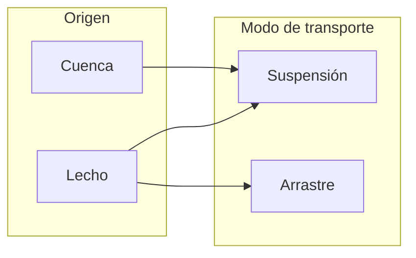

## Transporte de sedimentos 
Keywords: `Sediment transport` 

### Sedimentos
Se entiende por _sedimentos_ a todas las partículas de suelo y roca de una cuenca que son arrastradas y transportadas por una corriente de agua[^1]. Los sedimentos transportados por un cauce pueden provenir de dos fuentes:
* **Cuenca**: generados por la erosión de la superficie del terreno de la cuenca hidrográfica debido a la acción del viento y la lluvia. 
* **Lecho**: generados por la erosión del cauce principal y sus tributarios.

#### Clasificación de los sedimentos según su tamaño
En el siguiente cuadro se presenta la clasificación de los sedimentos según su tamaño con base en la clasificación de Rouse. Se muestra claramente lo que se define como arena, grava, suelos granulares y suelos cohesivos, lo cual es de gran utilidad en el transporte de sedimentos [^2].

| Tipo de suelo | Nombre | Tamaño | Tamiz |
|---|---|---|---|
| _**Suelos granulares**_ |**Canto rodado** |  |  |
|  | Muy grande | 4 m - 2 m |  |
|  | Grande | 2 m - 1 m |  |
|  | Mediano | 1 m - 0.5 m |  |
|  | Pequeño | 0.5 m - 0.25 m |  |
|  | **Guijarro** |  |  |
|  | Grande | 256 mm - 128 mm |  |
|  | Pequeño | 128 mm - 64 mm |  |
|  | **Grava** |  | Pasa el tamiz 3" y es retenido por el tamiz 4 |
|  | Muy gruesa | 64 mm - 32 mm |  |
|  | Gruesa | 32 mm - 16 mm |  |
|  | Mediana | 16 mm - 8 mm |  |
|  | Fina | 8 mm - 4 mm |  |
|  | Muy fina | 4 mm - 2 mm |  |
|  | **Arena** |  | Pasa el tamiz 4 y es retenido por el tamiz 200 |
|  | Muy gruesa | 2 mm - 1 mm |  |
|  | Gruesa | 1 mm - 1/2 mm |  |
|  | Mediana | 1/2 mm - 1/4 mm |  |
|  | Fina | 1/4 mm - 1/8 mm |  |
|  | Muy fina | 1/8 mm - 1/16 mm |  |
| _**Suelos cohesivos**_ | **Limo** |  | Pasa tamiz 200 |
|  | Grueso | 1/16 mm - 1/32 mm |  |
|  | Medio | 1/32 mm - 1/64 mm |  |
|  | Fino | 1/64 mm - 1/128 mm |  |
|  | Muy fino | 1/128 mm - 1/256 mm |  |
|  | **Arcilla** |  | Pasa tamiz 200 |
|  | Gruesa | 1/256 mm - 1/512 mm |  |
|  | Media | 1/512 mm - 1/1024 mm |  |
|  | Fina | 1/1024 mm - 1/2048 mm |  |
|  | Muy fina | 1/2048 mm - 1/4096 mm  |  |

### Clasificación del transporte de sedimentos

| [Actividad anterior]() | [Inicio](https://github.com/mflatouche/M.TSED/wiki) | [Actividad siguiente]()  |
|------------------------|----------------------------------------------------|----------------------------------------------------------------------------------------|

[^1]: Camargo, J., & Franco, V. (1999). _Manual de Ingeniería de Ríos_. México: Universidad Autónoma de México Instituto de Ingeniería.
[^2]: Rodríguez Díaz, H. A. (2010). _Hidráulica Fluvial. Fundamentos y aplicaciones. Socavación_. Colombia: Editorial Escuela Colombiana de Ingeniería.
