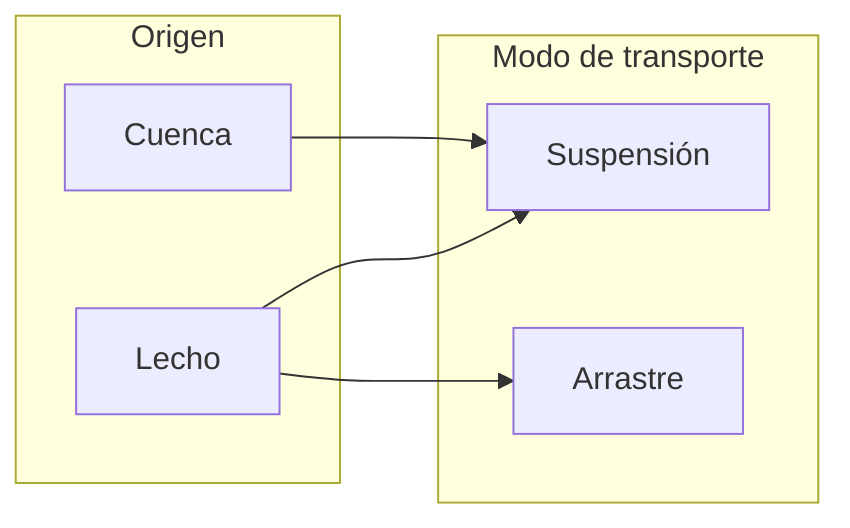

## Transporte de sedimentos 
Keywords: `Sediment transport` 

### Sedimentos
Se entiende por _sedimentos_ a todas las partículas de suelo y roca de una cuenca que son arrastradas y transportadas por una corriente de agua[^1]. Los sedimentos transportados por un cauce pueden provenir de dos fuentes:
* **Cuenca**: generados por la erosión de la superficie del terreno de la cuenca hidrográfica debido a la acción del viento y la lluvia. 
* **Lecho**: generados por la erosión del cauce principal y sus tributarios.

### Clasificación del transporte de sedimentos

| [Actividad anterior]() | [Inicio](https://github.com/mflatouche/M.TSED/wiki) | [Actividad siguiente]()  |
|------------------------|----------------------------------------------------|----------------------------------------------------------------------------------------|

[^1]: Manual de Ingeniería de Ríos
