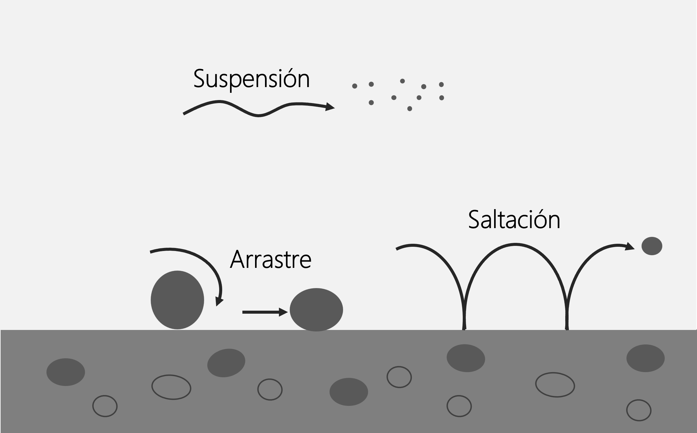
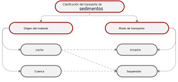
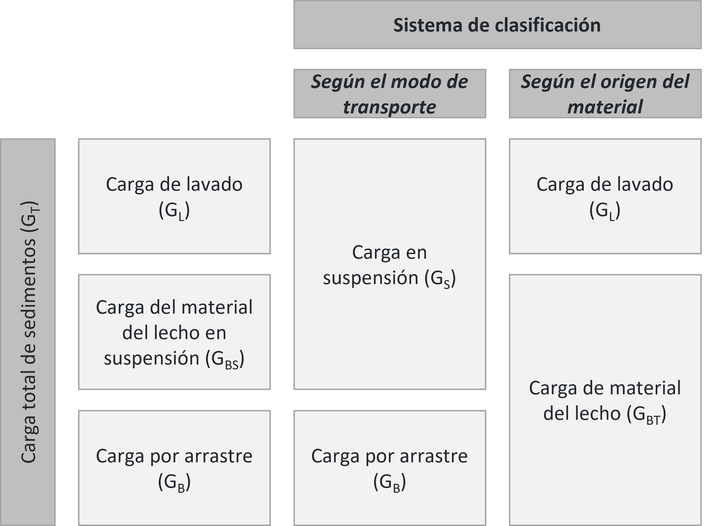

## Transporte de sedimentos 
Keywords: `Sediment transport` `Bedload` `Suspended load` `Washload`
### Sedimentos
Se entiende por _sedimentos_ a todas las partículas de suelo y roca de una cuenca que son arrastradas y transportadas por una corriente de agua[^1]. Los sedimentos transportados por un cauce pueden provenir de dos fuentes:
* **Cuenca**: generados por la erosión de la superficie del terreno de la cuenca hidrográfica debido a la acción del viento y la lluvia. 
* **Lecho**: generados por la erosión del cauce principal y sus tributarios.

#### Clasificación de los sedimentos según su tamaño
En el siguiente cuadro se presenta la clasificación de los sedimentos según su tamaño con base en la clasificación de Rouse. Se muestra claramente lo que se define como arena, grava, suelos granulares y suelos cohesivos, lo cual es de gran utilidad en el transporte de sedimentos[^2].

  
| Tipo de suelo           | Nombre           | Tamaño                | Tamiz                                          |
|-------------------------|------------------|-----------------------|------------------------------------------------|
| _**Suelos granulares**_ | **Canto rodado** |                       |                                                |
|                         | Muy grande       | 4 m - 2 m             |                                                |
|                         | Grande           | 2 m - 1 m             |                                                |
|                         | Mediano          | 1 m - 0.5 m           |                                                |
|                         | Pequeño          | 0.5 m - 0.25 m        |                                                |
|                         | **Guijarro**     |                       |                                                |
|                         | Grande           | 256 mm - 128 mm       |                                                |
|                         | Pequeño          | 128 mm - 64 mm        |                                                |
|                         | **Grava**        |                       | Pasa el tamiz 3" y es retenido por el tamiz 4  |
|                         | Muy gruesa       | 64 mm - 32 mm         |                                                |
|                         | Gruesa           | 32 mm - 16 mm         |                                                |
|                         | Mediana          | 16 mm - 8 mm          |                                                |
|                         | Fina             | 8 mm - 4 mm           |                                                |
|                         | Muy fina         | 4 mm - 2 mm           |                                                |
|                         | **Arena**        |                       | Pasa el tamiz 4 y es retenido por el tamiz 200 |
|                         | Muy gruesa       | 2 mm - 1 mm           |                                                |
|                         | Gruesa           | 1 mm - 1/2 mm         |                                                |
|                         | Mediana          | 1/2 mm - 1/4 mm       |                                                |
|                         | Fina             | 1/4 mm - 1/8 mm       |                                                |
|                         | Muy fina         | 1/8 mm - 1/16 mm      |                                                |
| _**Suelos cohesivos**_  | **Limo**         |                       | Pasa tamiz 200                                 |
|                         | Grueso           | 1/16 mm - 1/32 mm     |                                                |
|                         | Medio            | 1/32 mm - 1/64 mm     |                                                |
|                         | Fino             | 1/64 mm - 1/128 mm    |                                                |
|                         | Muy fino         | 1/128 mm - 1/256 mm   |                                                |
|                         | **Arcilla**      |                       | Pasa tamiz 200                                 |
|                         | Gruesa           | 1/256 mm - 1/512 mm   |                                                |
|                         | Media            | 1/512 mm - 1/1024 mm  |                                                |
|                         | Fina             | 1/1024 mm - 1/2048 mm |                                                |
|                         | Muy fina         | 1/2048 mm - 1/4096 mm |                                                |

  
### Modos de transporte de sedimentos
Los sedimentos pueden ser transportados por una corriente principalmente de las siguientes formas[^2]: 
* **Suspensión**: los materiales siguen los mismos movimientos del agua y se desplazan aproximadamente a la misma velocidad, se mantienen en suspensión debido a los remolinos generados por la turbulencia del flujo. En general, se tratan de partículas finas *(limos y arcillas)*, que se depositarán por gravedad solo cuando el flujo es muy lento o se estanca. Parte del material en suspensión puede ser arcilla coloidal, que puede permanecer en suspensión durante períodos de tiempo muy largos.
* **Arrastre**: el transporte de material por arrastre se realiza por la acción del esfuerzo cortante generado por la corriente sobre las partículas de sedimento. El movimiento de las partículas por arrastre puede ser de rodadura o deslizamiento sobre el lecho del cauce.
* **Saltación**: algunas partículas pueden moverse también sobre el lecho del cauce en *saltación*, el cual es un movimiento de saltos sucesivos discontinuos, se produce cuando una partícula choca con otra, haciendo que rebote hacia arriba y luego caiga de nuevo hacia el lecho. 

  

### Clasificación del transporte de sedimentos
Los sedimentos provenientes del material del lecho del cauce son transportados a lo largo del río por arrastre, y periódicamente pueden ser transportados en suspensión debido a la turbulencia del flujo. Los sedimentos provenientes de la cuenca son los materiales más finos, y, por lo tanto, son transportados únicamente en suspensión.

  

### Terminología del transporte de sedimentos
La terminología del transporte de sedimentos a veces puede ser confusa, por lo tanto, es importante definir algunos de los términos más utilizados y establecer la relación entre ellos[^3].

* **Carga de sedimentos o carga total de sedimentos (GT)**:la cantidad de sedimento que pasa por cualquier sección transversal de un río en un periodo de tiempo determinado, normalmente un día o un año. _Caudal sólido_, la masa o el volumen de sedimentos que pasa por una sección transversal de un arroyo en una unidad de tiempo. Las unidades típicas para la carga de sedimentos son toneladas, mientras que las unidades de caudal sólido son toneladas por día.
* **Carga de lavado (GL)**: parte de la carga total de sedimentos que está compuesta de las partículas de sedimento que tienen tamaños más finos que los sedimentos encontrados en el lecho del cauce.
* **Carga de material del lecho (GBT)**: parte de la carga total de sedimentos que está compuesta de las partículas de sedimento que tienen el mismo tamaño que los sedimentos encontrados en el lecho del cauce.
* **Carga por arrastre (GB)**: parte de la carga total de sedimentos que se desplaza en el lecho del río o cerca de él por saltación, rodadura o deslizamiento en la capa de fondo.
* **Carga del material del lecho en suspensión (GBS)**: parte de la carga de material del lecho que se transporta en suspensión en la columna de agua. La carga de material del lecho en suspensión y la carga por arrastre comprenden la carga total de material del lecho.
* **Carga en suspensión (GS)**: parte de la carga total de sedimentos que es transportada en suspensión por la turbulencia del flujo de agua.

Los términos presentados pueden combinarse de varias maneras para obtener la carga total de sedimentos en un cauce:
* La carga total de sedimentos es la suma de la carga en suspensión y la carga por arrastre:

$G_{T}=G_{S}+G_{B}$

 

* La carga total de sedimentos es la suma de la carga de lavado y la carga de material del lecho:

$G_{T}=G_{L}+G_{BT}$

 

* La carga de material del lecho está conformada por la carga del material del lecho en suspensión y la carga por arrastre:

$G_{BT}=G_{BS}+G_{B}$

 

* La carga en suspensión está conformada por la carga del material del lecho en suspensión y la carga de lavado:

$G_{S}=G_{BS}+G_{L}$

 
En la siguiente figura se muestran representadas esquemáticamente las ecuaciones presentadas.

   

### Licencia, cláusulas y condiciones de uso

M.TSED es de uso libre para fines académicos, conoce nuestra licencia, cláusulas, condiciones de uso y como referenciar los contenidos publicados en este repositorio, dando [clic aquí](https://github.com/mflatouche/M.TSED/wiki/License).

|  [:house: Inicio](../../README.md) | [:beginner: Ayuda]() | [Siguiente](../1_ClasificacionRios) |
|-------------------------------------------------------------|----------------------|-------------------------------------|

[^1]: Instituto de Ingeniería UNAM. (1999). Manual de Ingeniería de Ríos. México: Universidad Autónoma de México.
[^2]: Rodríguez Díaz, H. A. (2010). _Hidráulica Fluvial. Fundamentos y aplicaciones. Socavación_. Colombia: Editorial Escuela Colombiana de Ingeniería.
[^3]: Federal Agency Stream Restoration Working Group. (2001). _Stream Corridor Restoration: Principles, Processes, and Practices_. FISRWG.
