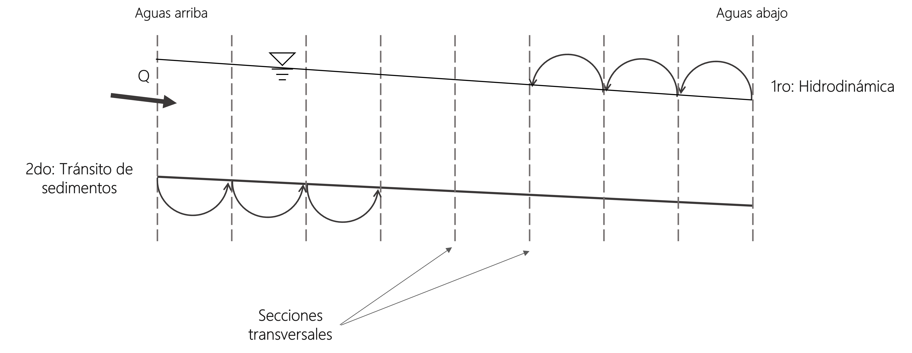
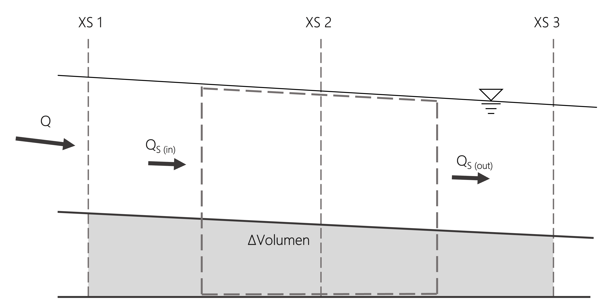
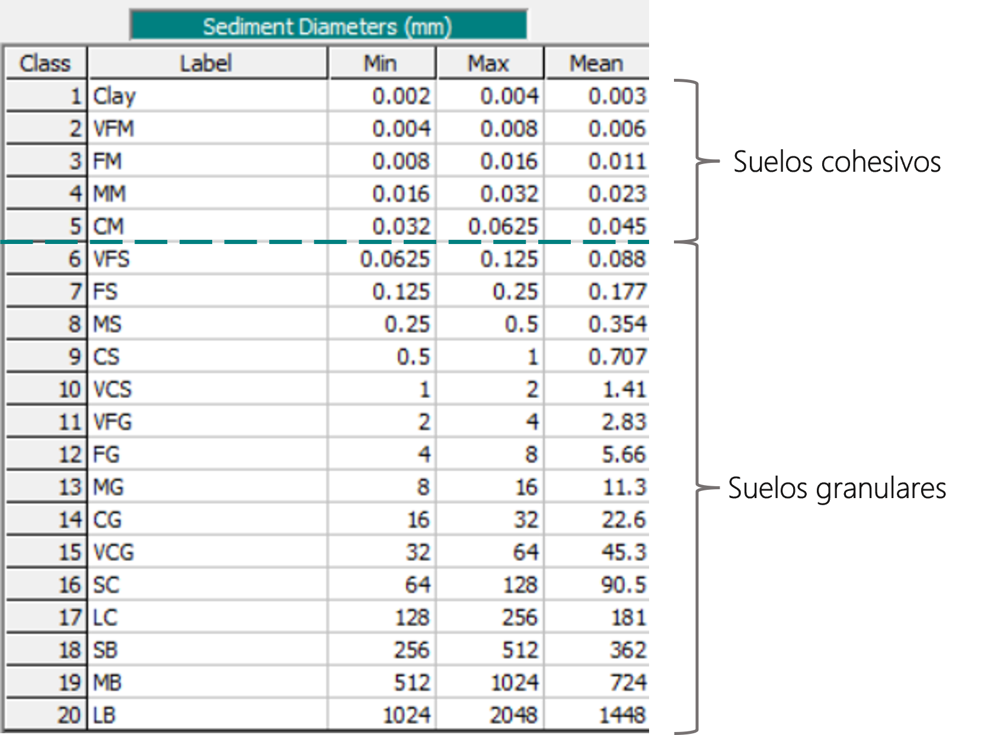

## Funcionamiento del modelo de HEC-RAS 1D
Keywords: `Sediment transport` 

### Acoplamiento entre las características hidráulicas y de sedimentos

HEC-RAS es un modelo acoplado explícito, el cual, para cada incremento computacional $(\Delta t)$ realiza el tránsito hidráulico y de sedimentos en todo el tramo en estudio.

En primer lugar, el modelo calcula las características hidráulicas del sistema desde aguas abajo hacia aguas arriba para cada sección transversal. Luego, utilizando las ecuaciones de transporte de sedimentos y las características hidráulicas determinadas previamente, realiza el tránsito de sedimentos desde aguas arriba hacia aguas abajo. Por último, el modelo actualiza las secciones transversales del cauce y comienza otra vez el ciclo para el siguiente incremento computacional[^1]. 

  

### Continuidad de sedimentos

Para realizar el tránsito de sedimentos, HEC-RAS resuelve la ecuación de Exner, la cual es una ecuación de conservación de la masa (o continuidad) que se aplica a los sedimentos de un sistema fluvial.

  $\left ( 1-\lambda _{p} \right )B\frac{\delta \eta }{\delta t}=-\frac{\delta Q_{s}}{\delta x}$

Donde:

$B$ = Ancho del canal

$η$ = Elevación del canal

$λ_{p}$ = Porosidad de la capa activa

$t$ = Tiempo

$x$ = Distancia

$Q_{s}$ = Carga de sedimentos transportada

La ecuación expresa que la diferencia entre el caudal sólido que sale del volumen de control y el caudal sólido que ingresa a este en un intervalo de tiempo es igual al volumen de material sólido acumulado o perdido en el interior, el cual se convierte en un ascenso o descenso de la elevación del fondo del cauce[^2]. Entonces, la ecuación de continuidad de sedimentos también se puede escribir como:

  $Q_{S (in)}-Q_{S (out)}=\frac{\Delta V}{\Delta t}=(1-\lambda _{p})B\frac{\Delta \eta }{\Delta t}$

Donde:

$Q_{S (in)}$ = Caudal sólido ingresando al volumen de control

$Q_{S (out)}$ = Caudal sólido saliendo del volumen de control

$V$ = Volumen de material sólido

    

HEC-RAS resuelve la ecuación de continuidad de sedimentos calculando una capacidad de transporte de sedimentos para el volumen de control $(Q_{S (out)})$ asociada a cada sección transversal, comparándola con el caudal de sedimentos $(Q_{S (in)})$ que entra en el volumen de control desde aguas arriba. Si la capacidad de transporte es mayor que el caudal sólido ingresando al volumen de control, HEC-RAS satisface el déficit mediante la erosión de los sedimentos del lecho. Si la oferta supera la capacidad, HEC-RAS deposita el excedente de sedimentos[^3].

### Tránsito de sedimentos por tamaño de partícula

Las ecuaciones de transporte de sedimentos generalmente están planteadas para un único tamaño de partícula, sin embargo, en la realidad ese no es el caso que se presenta. HEC-RAS divide los sedimentos en múltiples intervalos de clase y calcula el potencial de transporte de sedimentos para cada uno de estos. La capacidad de transporte para cada intervalo de clase es el potencial de transporte de sedimentos multiplicado por el porcentaje de ese tamaño de particula presente en el material del lecho, el cual es el material disponible para ser transportado. Entonces, la capacidad total de transporte es:

  $T_{c}=\sum_{j=1}^{n} \beta _{j}T_{j}$

Donde:

$T_{c}$ = Capacidad total de transporte de sedimentos

$n$ = Cantidad de intervalos de clase 

$\beta _{j}$ = Porcentaje del material del intervalo de clase "j" presente en la capa activa del lecho

$T_{j}$ = Potencial de transporte de sedimentos calculado para el material del intervalo de clase "j"

Las partículas de sedimentos con diámetro menor a 0.0625 mm (limos y arcillas) son materiales cohesivos, esto cambia significativamente la forma en que el material se transporta. En este tipo de material se tiene tanta área superficial que las fuerzas electroquímicas entre las partículas son más relevantes que las fuerzas debidas a la gravedad, por lo tanto, se tienen que utilizar diferentes algoritmos para estos determinar la capacidad de transporte de estos materiales.

    

### Limitantes físicos

En los pasos anteriores se determinó el caudal sólido ingresando al volumen de control $(Q_{S (in)})$ y se calculó el caudal sólido que el flujo podría mover utilizando las ecuaciones de transporte de sedimentos $(T_{c})$. Al comparar estos dos valores se tiene un déficit o un exceso de sedimentos:

$Q_{S (in)}>T_{c}\rightarrow$ Exceso (sedimentación)
    
$Q_{S (in)} \< T_{c}\rightarrow$ Déficit (erosión)

Sin embargo, antes de erosionar o depositar los sedimentos en el volumen de control se deben tener en cuenta ciertos procesos físicos que limitan la cantidad de sedimentos que realmente se pueden erosionar o sedimentar en un intervalo de tiempo, a estos se les llaman _limitantes físicos_.

#### Velocidad de caída _(Fall Velocity)_

El modelo deposita la cantidad de sedimentos que físicamente pueden caer al lecho en un intervalo de tiempo dado.

Métodos disponibles para HEC-RAS 1D:

* Ruby
* Toffaleti
* Van Rijn
* Dietrich
* Report 12

#### Acorazamiento _(Sorting)_

Una capa de lecho acorazada puede limitar la erosión en el cauce. Los algoritmos de acorazamiento estiman una limitación en la cantidad de material del lecho que puede ser erosionado.

Métodos disponibles para HEC-RAS 1D:

* Thomas Mixing Method (Exner 5)
* Copeland Mixing Method (Exner 7)
* Active Layer Mixing Method

### Cambio en la sección transversal

En cada volumen de control se ha determinado un volumen de sedimentos que es erosionado o depositado, a partir de esta estimación se modifica la sección transversal del cauce.

Existen diferentes métodos para modificar la sección transversal del cauce con base en el cambio en el volumen de sedimentos estimado

### Licencia, cláusulas y condiciones de uso

M.TSED es de uso libre para fines académicos, conoce nuestra licencia, cláusulas, condiciones de uso y como referenciar los contenidos publicados en este repositorio, dando [clic aquí](https://github.com/mflatouche/M.TSED/wiki/License).

| [Anterior]() | [:house: Inicio](../../README.md) | [:beginner: Ayuda]() | [Siguiente]() |
|--------------|-----------------------------------|----------------------|---------------|

[^1]: Australian Water School. (2019, Agosto 22). _Sediment transport modelling. Too hard for Einstein?_ Retrieved from https://www.youtube.com/watch?v=76FjruCW4KA&list=LL&index=9&t=2462s
[^2]: Martín V., J. P. (2009). _Ingeniería de ríos_. Barcelona: Univ. Politèc. de Catalunya.
[^3]: Hydrologic Engineering Center. (s.f.). Hydrologic Engineering Center's (CEIWR-HEC) River Analysis System (HEC-RAS). Obtenido de 1D Sediment Transport Technical Reference Manual: https://www.hec.usace.army.
