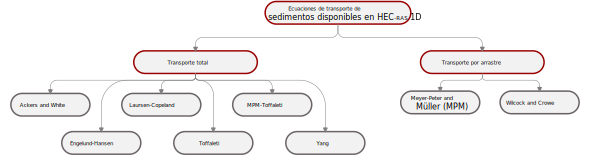

<b> Universidad Escuela Colombiana de Ingeniería Julio Garavito</b>
 
María Fernanda Latouche Facenda
 
Profesora del Centro de Estudios Hidráulicos
 
maria.latouche@escuelaing.edu.co

## Módulo 2 - Actividad 3. Funciones de transporte de sedimentos
Keywords: `Sediment transport potencial` `HEC-RAS 1D` 

    

### Funciones de transporte de sedimentos

Como se explicó anteriormente, HEC-RAS calcula el potencial de transporte de sedimentos para cada intervalo de clase de la granulometría del material del lecho con una de las ecuaciones de transporte de sedimentos disponibles en el programa.

HEC-RAS incluye ocho funciones de potencial de transporte de sedimentos en 1D. El transporte de sedimentos es sensible a muchas variables, por lo tanto, el potencial de transporte calculado con las diferentes ecuaciones pueden variar en órdenes de magnitud debido a que son ecuaciones empíricas y cada una de estas fue desarrollada bajo diferentes condiciones. En la medida de lo posible, se recomienda seleccionar una función de transporte desarrollada para granulometrías y parámetros hidráulicos similares a los del tramo del proyecto. El esquema presentado a continuación muestra las funciones disponibles.

  

En la siguiente tabla se muestran las funciones de potencial de transporte de sedimentos, el modo de transporte que calcula, el tipo de aproximación que usa y una breve descripción de las condiciones particulares para las cuales fueron desarrolladas.

| Ecuación | Tipo de transporte | Tipo de aproximación | Descripción |
| --- | --- | --- | --- | 
| Ackers and White | Transporte total | Potencia de la corriente | Desarrollado a partir de datos de canal para granulometrías relativamente uniformes que van desde arena hasta gravas finas. HEC-RAS muestra tres parámetros de la ecuación: el umbral de movilidad (A) y los coeficientes (C y m) para que los usuarios puedan calibrarlos. Sin embargo, son parámetros dinámicos, cambian con las propiedades de los sedimentos y el flujo. Los modeladores que opten por calibrar Ackers-White deberían utilizar los factores de escala en su lugar. | 
| Engelund-Hansen | Transporte total | Potencia de la corriente | Desarrollado a partir de datos de canal, utilizando tamaños de arena relativamente uniformes entre 0.19 mm y 0.93 mm. A menudo puede calcular transportes bajos para partículas de tamaños grandes. Engelund-Hansen debería limitarse normalmente a sistemas de arena. | 
| Laursen-Copeland | Transporte total | Esfuerzos cortantes | La versión de Copland de la ecuación de Laursen fue desarrollada para particulas de tamaño desde limo grueso hasta gravas, esto le confiere la más amplia gama de aplicabilidad de las funciones de transporte incluidas en HEC-RAS Es la única función de transporte desarrollada en el rango de limo grueso y un trabajo no publicado en Colorado State (Watson, comunicación personal) demostró que esta ecuación superaba a otras funciones de transporte en el rango de arena muy fina y limo muy grueso. Se utiliza con el método de mezcla de Copeland (algoritmo de acorazamiento), si la ecuación se utiliza sola, sobrestima el potencial de transporte. | 
| Meyer-Peter and Müller (MPM) | Transporte por arrastre | Esfuerzos cortantes | La MPM es estrictamente una ecuación de carga por arrastre desarrollada a partir de experimentos de canal de arena y grava en condiciones de lecho plano. Los experimentos de MPM examinaron principalmente grava uniforme, lo que hace que la función de transporte MPM sea más aplicable en sistemas de grava. La ecuación de MPM tiende a subestimar el transporte de materiales más finos. | 
| Toffaleti | Transporte total | Probabilística | Desarrollada principalmente para partículas del tamaño de arena, sigue los principios básicos del enfoque de Einstein, sustituyendo algunos de los supuestos empíricos. Toffaleti suele aplicarse a "grandes ríos", ya que la mayoría de los datos utilizados para desarrollarla procedían de grandes sistemas de carga suspendida. Su desempeño es particularmente deficiente para las partículas de tamaño de grava. HEC-RAS puede mostrar los resultados del transporte de cada zona por separado, aproximando el perfil de concentración vertical. A veces los modeladores utilizan esta función para calibrar las mediciones de carga suspendida, comparando la medición con el caudal sólido calculado de las tres zonas superiores. | 
| MPM-Toffaleti | Transporte total | - | La ecuación de Toffaleti se desarrolló para ríos de gran tamaño y lecho de arena, y su desempeño no es bueno para partículas gruesas. Esta función combinada sustituye el componente del transporte por arrastre de Toffaleti por la ecuación de MPM, que es más apropiada para el material grueso. | 
| Yang | Transporte total | Potencia de la corriente | La función fue desarrollada y probada sobre una variedad de datos de canal y de campo. La ecuación incluye dos relaciones separadas para el transporte de arena y grava. La ecuación de Yang tiende a ser muy sensible a la velocidad de la corriente, y es más sensible a la velocidad de caída que la mayoría de las otras funciones de transporte. | 
| Wilcock and Crowe | Transporte por arrastre | Esfuerzos cortantes | Diseñado para ríos bien gradados que contienen tanto arena como grava. Los lechos solían estar acorazados, con un contenido de arena mucho menor en la superficie que en el subsuelo. Por lo tanto, los usuarios deben elegir algoritmos de capas activas y las granulometrías deben reflejar las propiedades de la superficie del lecho. Se recomienda utilizar siempre esta función con el método de mezcla del lecho de la capa activa (Active Layer). Para calibrar la ecuación de Wilcock & Crowe (2003) ajuste el factor de escala de movilidad (mobility scaling factor). | 

### Licencia, cláusulas y condiciones de uso

M.TSED es de uso libre para fines académicos, conoce nuestra licencia, cláusulas, condiciones de uso y como referenciar los contenidos publicados en este repositorio, dando [clic aquí](https://github.com/mflatouche/M.TSED/wiki/License).

| [Anterior](../2_Modelo) | [:house: Inicio](../../README.md) | [:beginner: Ayuda]() | [Siguiente](../2_InformacionCampo) |
|------------------|-----------------------------------|----------------------|-------------------|

[^1]: Hydrologic Engineering Center. (s.f.). Hydrologic Engineering Center's (CEIWR-HEC) River Analysis System (HEC-RAS). Obtenido de 1D Sediment Transport Technical Reference Manual: https://www.hec.usace.army.

##

 Este curso guía ha sido desarrollado con el apoyo de la Universidad Escuela Colombiana de Ingeniería Julio Garavito. Encuentra más contenidos en https://github.com/uescuelaing  
