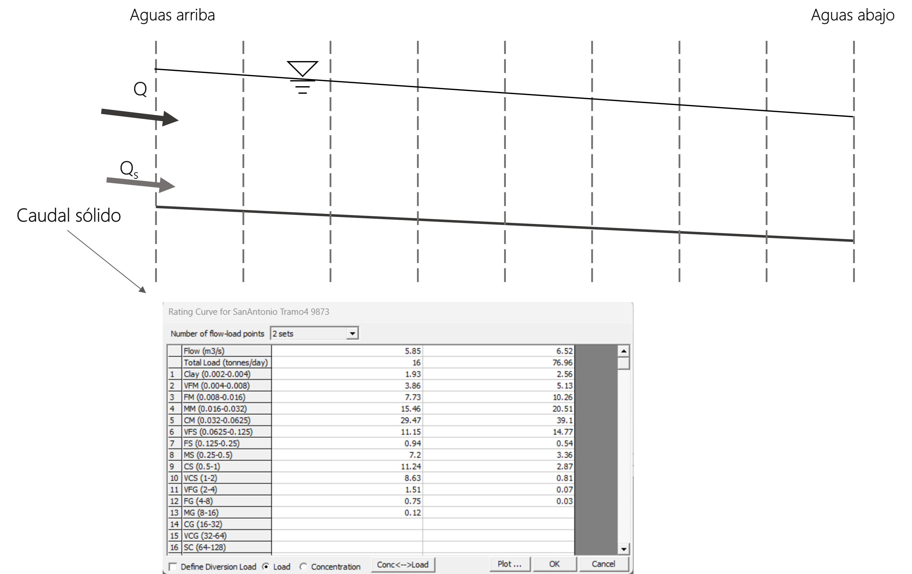

## Información de campo
Keywords: `Sediment transport` `Information` 

### Información necesaria para la elaboración de un modelo de transporte de sedimentos unidimensional

En la actividad anterior se mostró la estructura de un modelo de transporte de sedimentos unidimensional en HEC-RAS, este requiere de tres tipos de archivos de información: geometría, caudales y sedimentos. En este apartado se indicará la información de campo mínima necesaria para generar estos archivos.

#### Geometría

Para el modelo de transporte de sedimentos se utiliza la misma geometría que para un modelo hidráulico. En términos generales, se necesitan las secciones transversales del río que se va a analizar. Esta información se puede obtener a partir de levantamientos topobatimétricos e ingresar individualmente las secciones transversales o se pueden obtener mediante la construcción de un modelo de terreno.

    

La mayoría de los estudios hidráulicos de HEC-RAS comienzan con la mejor y más reciente información de secciones transversales disponible. Los estudios de sedimentos, sin embargo, suelen comenzar con secciones transversales históricas y se calibran ejecutando el período de registro entre estas secciones transversales históricas y una batimetría actual. Una vez calibrado el modelo, las proyecciones futuras suelen comenzar con la mejor y más reciente batimetría disponible. Pero un buen conjunto de secciones transversales históricas es una de la información más valiosa que puede tener un estudio de transporte de sedimentos[^1].

#### Caudales

En la condición de frontera aguas arriba se requiere la serie de caudales que se desee modelar, tanto si se hace el análisis son flujo cuasi-no permanente o con flujo no permanente.

    

Para realizar la calibración del modelo, se utiliza una serie de caudales histórica con registros comprendidos entre las fechas de la batimetría histórica y la batimetría actual.

#### Sedimentos

En general se necesitan dos tipos de información de sedimentos, una correspondiente al material del lecho disponible y otra al caudal sólido que ingresa al sistema en la sección aguas arriba.

* Granulometría del material del lecho

Cada sección transversal requiere datos de granulometría inicial del material del lecho. Sin embargo, en lugar de exigir a los usuarios que introduzcan las granulometrías para cada sección transversal individualmente, HEC-RAS utiliza un concepto de plantilla en el cual los usuarios definen las granulometrías de sedimentos en una base de datos y luego las asocian con las secciones transversales apropiadas[^1].

    

La granulometría del material del lecho puede ser ingresada como porcentaje retenido o como porcentaje que pasa.

HEC-RAS estima el potencial de transporte de sedimentos en cada sección transversal con base en la granulometría del material del lecho asociada en cada una de estas.

* Caudal sólido

En las condiciones de frontera de sedimentos, se requieren aforos líquidos y sólidos que permitan asociar la carga de sedimentos que transporta un caudal líquido dado. Además del valor de la carga total de sedimentos, se necesita la granulometría del material transportado. La granulometría del material sólido transportado solamente puede ser ingresada como porcentaje retenido.

    

El caudal sólido está compuesto por el material transportado por arrastre y el material en suspensión; el aforo del material en suspensión es relativamente sencillo, sin embargo, tomar muestras representativas del material por arrastre resulta difícil [^2], razón por la cual normalmente se tiene mayor cantidad de datos del caudal sólido en suspensión que del caudal sólido por arrastre. Entre algunas de las estrategias utilizadas para completar la información de caudal sólido por arrastre faltante están: determinar el caudal sólido por arrastre como carga de equilibrio a partir de ecuaciones de potencial de transporte, asumir el caudal sólido por arrastre como un porcentaje del caudal sólido en suspensión y si las características del sistema fluvial lo permiten, asumir que el caudal sólido por arrastre es despreciable en comparación con el caudal sólido por suspensión y tener en cuenta únicamente este último.

### Licencia, cláusulas y condiciones de uso

M.TSED es de uso libre para fines académicos, conoce nuestra licencia, cláusulas, condiciones de uso y como referenciar los contenidos publicados en este repositorio, dando [clic aquí](https://github.com/mflatouche/M.TSED/wiki/License).

| [Anterior]() | [:house: Inicio](../../README.md) | [:beginner: Ayuda]() | [Siguiente]() |
|--------------|-----------------------------------|----------------------|---------------|

[^1]: Hydrologic Engineering Center. (s.f.). Hydrologic Engineering Center's (CEIWR-HEC) River Analysis System (HEC-RAS). Obtenido de 1D Sediment Transport User's Manual Manual: https://www.hec.usace.army.

[^2]: Food and Agriculture Organization of the United States (FAO). _Capítulo 5 - Transporte de sedimentos_. Obtenido de: https://www.fao.org/3/t0848s/t0848s07.htm.