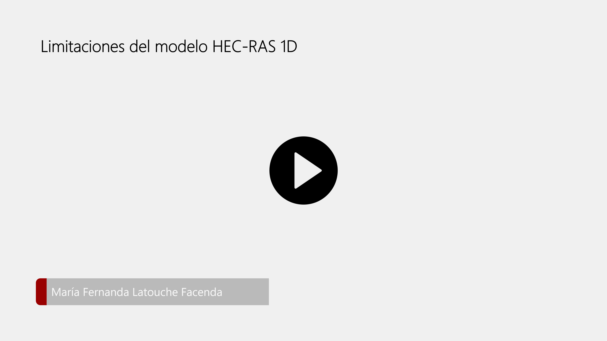

## Limitaciones del modelo HEC-RAS 1D
Keywords: `HEC-RAS 1D` `Model limitations`

    

En esta actividad se presentan algunas ventajas y limitaciones del modelo HEC-RAS 1D que se deben tener en consideración al momento de usar el software.

    

### Ventajas

En general, algunas de las ventajas que ofrece el modelo unidimensional son:

* Permite el cálculo en dominios con escalas muy grandes. La simulación de kilómetros de río se realiza con una alta velocidad de cálculo.
* La simplificación del flujo turbulento tridimensional a un flujo unidimensional es relativamente aceptable para rios a grandes escalas cuando no se necesita una alta precisión en los resultados.
* Permite el análisis con secciones naturales no regulares (cauces fluviales: cauce principal y llanuras de inundación).
* Gran capacidad de importación y exportación de datos en entorno Windows para el post procesamiento de los resultados y su presentación.
* Su licencia es gratis.

### Limitaciones 

Se debe tener en consideración las siguientes limitaciones del modelo de transporte de sedimentos unidimensional en HEC-RAS:

* HEC-RAS 1D es un modelo a escala de _tramo_. No es recomendable realizar análisis sobre los resultados de los cambios en secciones transversales individuales.
* HEC-RAS 1D es un modelo a escala _decadal_. No es recomendable realizar análisis sobre eventos individuales.
* En el modelo se utilizan algoritmos _empíricos_, por lo cual el modelo de transporte de sedimentos debe ser calibrado para producir resultados confiables.
* Es un modelo unidimensional, por lo tanto, no se tiene tan buen desempeño en el análisis de: zonas de amortiguamiento, derivaciones de flujo, procesos de sedimentación en las llanuras.
* Análisis de flujos newtonianos, aquellos con concentraciones de sólidos menor al 5-10%.
* Información de campo. La información de sedimentos normalmente es escasa.
* Para realizar el modelo de transporte de sedimentos se debe tener previamente un buen modelo hidráulico calibrado.
* Solo se pueden modelar cauces con pendientes menores al 10% debido a que no se tiene en cuenta la componente vertical del peso de la columna de agua en las ecuaciones.

### Licencia, cláusulas y condiciones de uso

M.TSED es de uso libre para fines académicos, conoce nuestra licencia, cláusulas, condiciones de uso y como referenciar los contenidos publicados en este repositorio, dando [clic aquí](https://github.com/mflatouche/M.TSED/wiki/License).

| [Anterior](../2_InformacionCampo) | [:house: Inicio](../../README.md) | [:beginner: Ayuda]() | [Siguiente](../../Section03) |
|------------------|-----------------------------------|----------------------|------------------------------|

[^1]: Colegio de Agrimensores. (2088). _Capitulo 3. Introducción al HEC-RAS_.

[^2]: Australian Water School. (22 de Agosto de 2019). _Sediment transport modelling. Too hard for Einstein?_ Obtenido de https://www.youtube.com/watch?v=76FjruCW4KA&list=LL&index=9&t=2462s

[^3]: Gibson, S. (10 de Junio de 2019). _Intro to HEC-RAS Sediment Demo (Part 3 of 3 - Simulation and Output)_. Obtenido de https://www.youtube.com/watch?v=X9xikwi0v-U&t=225s

[^4]: Hydrologic Engineering Center. (s.f.). Hydrologic Engineering Center's (CEIWR-HEC) River Analysis System (HEC-RAS). Obtenido de 1D Sediment Transport Technical Reference Manual: https://www.hec.usace.army.

