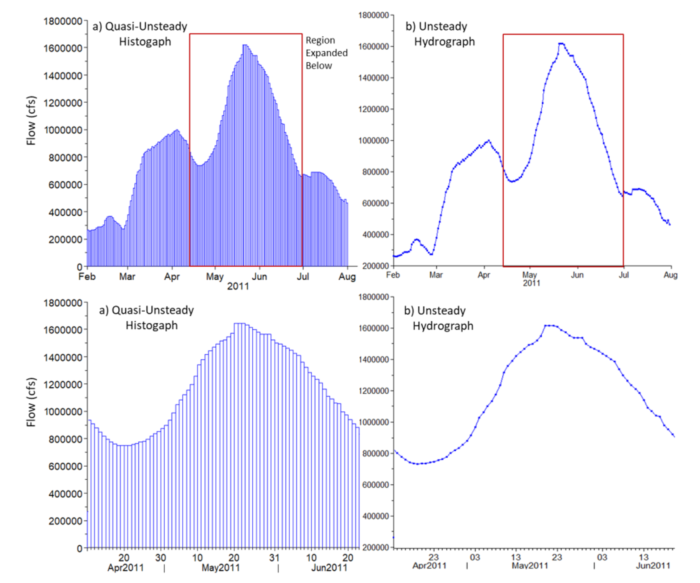
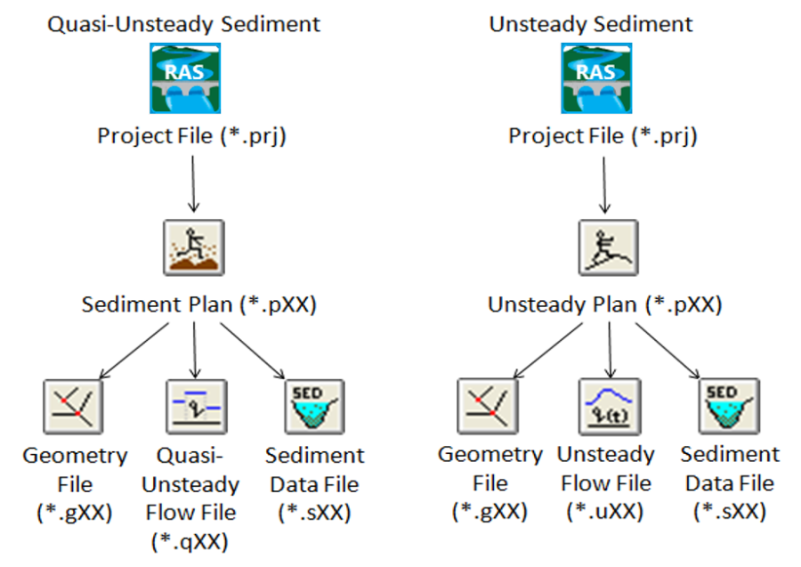

## Estructura del modelo de transporte de sedimentos
Keywords: `Sediment transport` 

    

### Enfoques del modelo de transporte de sedimentos

HEC-RAS incluye dos enfoques hidrodinámicos para realizar el análisis de transporte de sedimentos:

* Flujo cuasi- no permanente
* Flujo no permanente

Los modelos de transporte de sedimentos son la aplicación más común del enfoque de flujo cuasi-no permanente. En este caso, el modelo simula las series de caudales como una secuencia de flujos permanentes.

El modelo de transporte de sedimentos también puede realizarse utilizando el enfoque de flujo no permanente, sin embargo, es necesario tener un modelo hidráulico preciso, calibrado y estable antes de realizar el análisis de transporte de sedimentos. El modelado de flujo no permanente requiere una práctica cuidadosa y hábil porque la solución puede ser inestable con un lecho fijo.

    

> (a) Hidrograma modelado con flujo cuasi-no permanente (b) Hidrograma modelado con flujo no permanente. Fuente: Hydrologic Engineering Center[^1]

Independientemente del enfoque que se escoja, se necesitan tres tipos de archivos para construir un modelo de transporte de sedimentos:

* Archivo de geometría
* Archivo de caudales
* Archivo de información de sedimentos

En la siguiente figura se muestra la estructura de los archivos para modelos de transporte de sedimentos con flujo cuasi-no permanente y con flujo no permanente.

    

> Estructura de los archivos para modelos de transporte de sedimentos con flujo cuasi-no permanente y con flujo no permanente. Fuente: Hydrologic Engineering Center[^1]

La selección del modelo hidrodinámico apropiado para un análisis de transporte de sedimentos con HEC-RAS implica las clásicas compensaciones entre precisión y esfuerzo (Gibson 2013). La modelación con flujo cuasi-no permanente tiende a ser más fácil, pero no conserva el caudal, por lo que puede introducir errores inaceptables, particularmente en sistemas con un almacenamiento significativo. Por otro lado, la modelación de flujo no permanente requiere una práctica cuidadosa y hábil porque la solución puede ser inestable con un lecho fijo, sin embargo, conserva la masa y tiene en cuenta explícitamente el cambio de volumen, lo que lo hace especialmente aplicable a la modelación de embalses (Gibson y Boyd, 2014), a modelos con estructuras de flujo lateral, a flujos inversos o a los problemas de ingeniería en los que el tiempo pico del hidrograma es crítico.

En la siguiente tabla se muestran algunas características de los dos enfoques hidrodinámicos:

| Cuasi-no permanente | No permanente                                                                                                                                                                                            |
|---|----------------------------------------------------------------------------------------------------------------------------------------------------------------------------------------------------------|
| Resuelve las ecuaciones de flujo permanente para una serie de caudales con tiempos asociados (un histograma). | Resuelve las ecuaciones de Saint-Venant de forma implícita.                                                                                                                                              |
| No conserva el caudal ni tiene en cuenta el almacenamiento. | Conserva el caudal y tiene en cuenta del almacenamiento en embalses.                                                                                                                                     |
| Más estable. | Menos estable. El cambio en las secciones transversales puede incrementar las inestabilidades del modelo, comunes a la solución de Saint-Venant.                                                         |
| Limitado a las opciones de flujo permanente. | Se dispone de condiciones de frontera de flujo complejas que incluyen interflujos de aguas subterráneas, reglas operacionales , estructuras laterales, controles de compuertas internas, bombas y otros. |
> Criterios de decisión para la selección de simulaciones de transporte de sedimentos con flujo cuasi-no permanente o flujo no permanente. Adaptado de: Hydrologic Engineering Center[^1]

### Licencia, cláusulas y condiciones de uso

M.TSED es de uso libre para fines académicos, conoce nuestra licencia, cláusulas, condiciones de uso y como referenciar los contenidos publicados en este repositorio, dando [clic aquí](https://github.com/mflatouche/M.TSED/wiki/License).

| [Anterior](../2_Funcionamiento) | [:house: Inicio](../../README.md) | [:beginner: Ayuda]() | [Siguiente](../2_FuncionesTransporte) |
|------------------|-----------------------------------|----------------------|-------------------|

[^1]: Hydrologic Engineering Center. (s.f.). Hydrologic Engineering Center's (CEIWR-HEC) River Analysis System (HEC-RAS). Obtenido de 1D Sediment Transport User's Manual Manual: https://www.hec.usace.army.

##

 Este curso guía ha sido desarrollado con el apoyo de la Universidad Escuela Colombiana de Ingeniería Julio Garavito. Encuentra más contenidos en https://github.com/uescuelaing  
