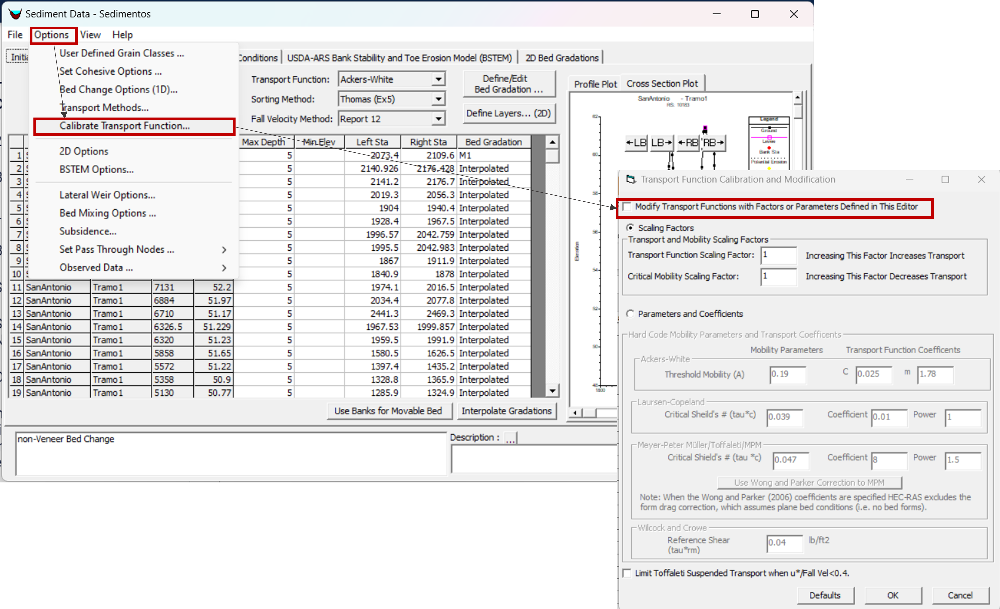

## Calibración del modelo de transporte de sedimentos
Keywords: `Sediment transport` 

    

La calibración de un modelo de transporte de sedimentos se puede realizar de múltiples formas, dependiendo de la información que se tenga disponible. Generalmente, se utilizan los siguientes enfoques:

* **Batimetrías históricas**: se comienza con secciones transversales históricas y se calibran ejecutando el modelo desde el período de registro entre estas secciones transversales históricas y una batimetría contemporánea. 
* **Curva de calibración caudal líquido-carga de sedimentos**: en una sección transversal diferente a la de aguas arriba y en la que se tenga una curva de calibración de sedimentos a partir de datos de campo, se compara y ajustan los resultados del modelo hasta que las cargas de sedimentos simuladas sean similares a las medidas en campo.

Utilizaremos el primer enfoque, ya que en el caso de estudio se dispone de batimetrías realizadas el 01 de enero del 2010 y el 31 de diciembre del 2010. En el archivo en Excel llamado _"Data"_, en la última pestaña (_Calibración_) está una tabla en la que compararemos los resultados medidos y los simulados. Vamos a comparar la simulación con dos resultados: la elevación del fondo del canal (_Invert Elevation_) el 31 de diciembre deñ 2010 y el cambio acumulado del volumen del lecho (_Long. Cum Vol Change_) entre el 01 de enero y el 31 de diciembre del 2010 a partir de la información tomada en campo.

    

Vamos a extraer los resultados de la modelación que acabamos de ejecutar para compararlos con los valores históricos. En la ventana de resultados de Sedimentos (_Sediment Output_) seleccionamos el modo _Profile_, la fecha del final de la simulación (31Dec2010 0000) y las variables: _Invert Elevation_ y _Long. Cum Vol Change_ (total).

    

Seleccionamos _Table_ para ver los resultados como tabla y copiamos (CTRL+C) y pegamos (CTRL+V) los valores en el archivo de Excel.

    

En las gráficas podemos ver que el modelo está calculando mucha más erosión que lo que realmente se tuvo en ese período de tiempo.

    

### Selección de la función de transporte de sedimentos

Entonces, lo primero, es volver a ejecutar el modelo modificando la función de transporte. Cerramos las ventanas y abrimos nuevamente el editor del archivo de sedimentos.

    

Entre las [funciones de transporte](../../Section02/2_FuncionesTransporte) disponibles, la ecuación de Ackers and White es una función de transporte total aplicable para granulometrías que van desde arenas hasta gravas finas, por lo que podría servir para nuestro caso de estudio. En esta ejecución del modelo seleccionaré _Ackers-White_ como función de transporte, _Thomas(Ex5)_ como método de acorazamiento y _Report 12_ como método de estimación de velocidad de caída. Estoy escogiendo estos métodos porque ya hice la prueba anteriormente y sé que van a mejorar los resultados, pero realmente esto es un proceso de ensayo y error.

    

Guardamos el archivo de sedimentos y ejecutamos nuevamente el plan de transporte de sedimentos. Esperamos a que Hec-Ras finalice los cálculos y abrimos el visor de resultados de sedimentos.

    

Otra vez, vamos a extraer los resultados de la modelación que acabamos de ejecutar para compararlos con los valores históricos. En la ventana de resultados de Sedimentos (_Sediment Output_) seleccionamos el modo _Profile_, la fecha del final de la simulación (31Dec2010 0000) y las variables: _Invert Elevation_ y _Long. Cum Vol Change_ (total). Seleccionamos _Table_ para ver los resultados como tabla y copiamos (CTRL+C) y pegamos (CTRL+V) los valores en el archivo de Excel.

    

En las gráficas se puede observar que la diferencia en el cambio acumulado medido y simulado disminuyó, sin embargo, se podría mejorar aún más los resultados.

    

### Calibrar la función de transporte

Después de haber seleccionado la función de transporte más adecuada, podemos proceder a calibrar dicha ecuación. Para esto abrimos el editor de archivo de sedimentos y seleccionamos Options -> Calibrate Transport Function. Seleccionamos la casilla _Modify Transport Functions with Factors or Parameters Defined in This Editor_.

    

Hay dos opciones para calibrar la función de transporte, usando factores de escala (_Scaling Factor_) o definiendo los parámetros y coeficientes (_Parameters and Coefficients_), sin embargo, en el manual de Hec-Ras recomiendan utilizar solamente la primera opción.

    

Existen dos factores de escala:

    

* **Transport Function Scaling Factor**: este es un factor lineal en la función de transporte. Por ejemplo, 1.1 aumenta la capacidad de transporte en 10% y 0.9 disminuye la capacidad en 10%.
* **Critical Mobility Scaling Factor**: este factor afecta la [competencia de la corriente](../../Section01/1_Potencia) (el caudal mínimo que puede mover un tamaño dado de partícula) y la capacidad de transporte. Está inversamente relacionado con el caudal. Por ejemplo, un factor de 1.1 hará que las partículas de sedimento necesiten un caudal mayor para empezar a moverse, y, por lo tanto, disminuirá el transporte. Sus efectos no son lineales. Este factor de escala no aplica para las ecuaciones de Toffaleti y de Engelud-Hansen debido a que estas ecuaciones no tienen parámetros críticos de movibilidad.

Debido a que en los resultados del modelo se está generando mayor erosión que la obtenida en las mediciones de campo, aumentaré el _Critical Mobility Scaling Factor_ para disminuir la capacidad de transporte. Aumentaré el factor a un valor de 1.2

    

Selecciono el botón _OK_, guardo el archivo de sedimentos, ejecuto nuevamente el plan de transporte de sedimentos y extraigo del modelo los resultados que estamos analizando.

    

En azul se muestran los valores medidos y en amarillo, los resultados de la última simulación que realizamos.

    

Para cuantificar la diferencia entre los valores simulados y medidos, en la última fila de la hoja de Excel está calculada la raíz del error cuadrático medio (_Root Mean Square Error RMSE_). En la siguiente tabla resumo los resultados.

| Combinación utilizada                                               | Invert Elevation RMSE | Long. Cum Vol Change Total RMSE |
|---------------------------------------------------------------------|-----------------------|---------------------------------|
| Laursen-Copeland/Copeland/Rubey                                     | 0.602                 | 31649.638                       |
| Ackers-White/Thomas/Report12                                        | 0.164                 | 19238.773                       |
| Ackers-White(Critical Mobility Scaling Factor =1.2)/Thomas/Report12 | 0.150                 | 9729.743                        |

La última combinación modelada es la que produce un menor error (RMSE). Con esta combinación tendríamos calibrado el modelo.

    

### Licencia, cláusulas y condiciones de uso

M.TSED es de uso libre para fines académicos, conoce nuestra licencia, cláusulas, condiciones de uso y como referenciar los contenidos publicados en este repositorio, dando [clic aquí](https://github.com/mflatouche/M.TSED/wiki/License).

| [Anterior](../3_Resultados) | [:house: Inicio](../../README.md) | [:beginner: Ayuda]() |
|--------------------|-----------------------------------|----------------------|

[^1]: Federal Agency Stream Restoration Working Group. (2001). _Stream Corridor Restoration: Principles, Processes, and Practices_. FISRWG.

[^2]: Hydrologic Engineering Center. (s.f.). Hydrologic Engineering Center's (CEIWR-HEC) River Analysis System (HEC-RAS). Obtenido de 1D Sediment Transport Technical Reference Manual: https://www.hec.usace.army.

