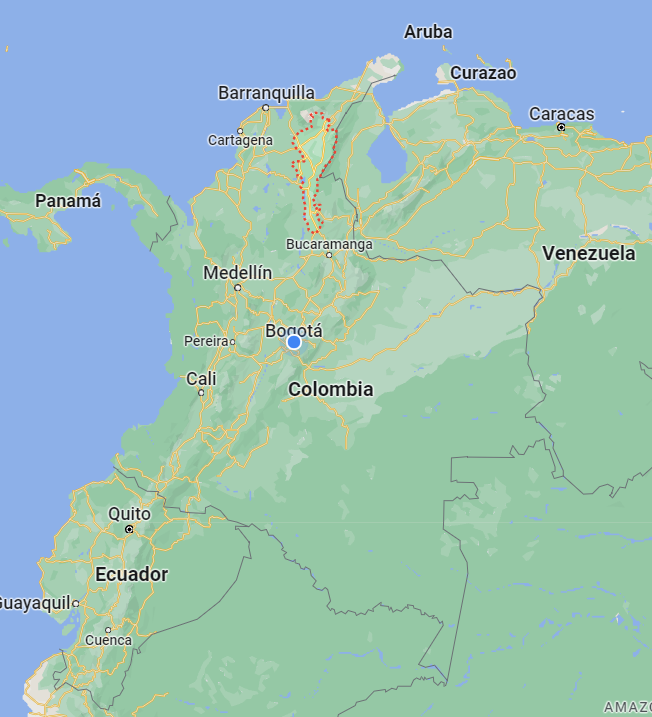
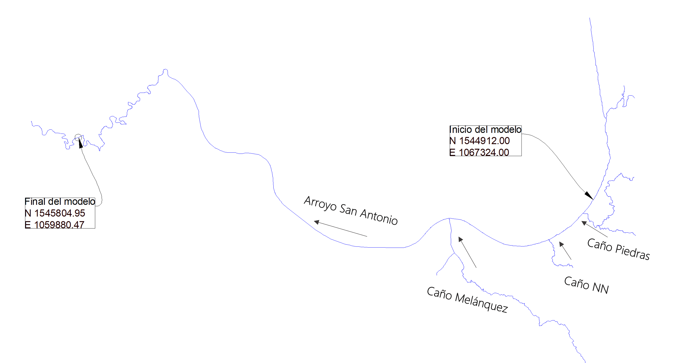
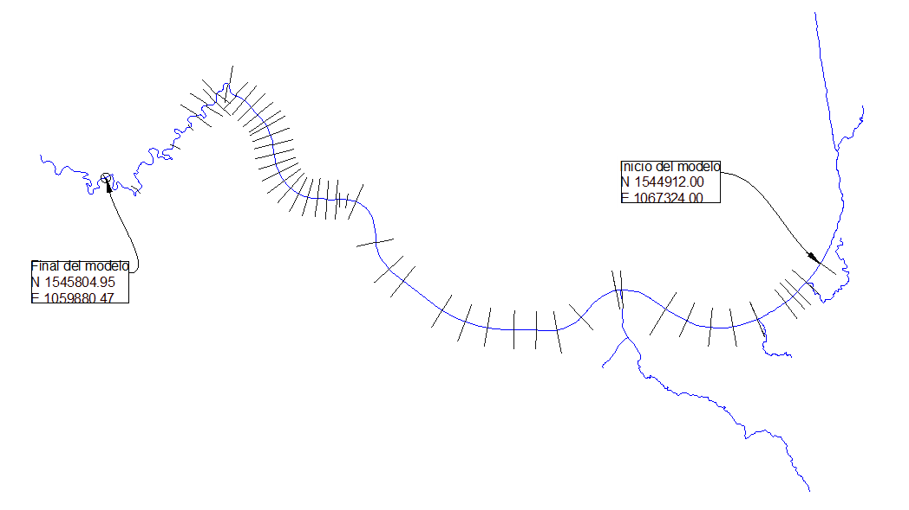
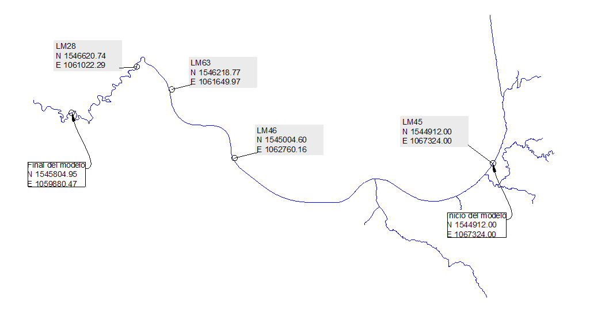

## Caso de estudio
Keywords: `Case study` `Colombia` `Sediment transport` 

    

### Generalidades

El caso de estudio que se va a analizar fue adaptado con fines académicos. Este corresponde a un tramo de aproximadamente 11 km de longitud del Arroyo San Antonio, ubicado en el departamento del Cesar, Colombia. 

    

En este tramo, al Arroyo San Antonio le llegan tres afluentes: Caño Piedras, Caño NN y Caño Melánquez; al inicio del tramo de estudio y en la entrega de los afluentes al arroyo se cuentan con registros de caudales diarios del año 2010.

    

En 55 secciones sobre el Arroyo San Antonio se realizaron levantamientos topobatimétricos el 01 de enero del 2010 y el 31 de diciembre del 2010, en la siguiente imagen se muestra un esquema de la ubicación de estas secciones.

    

En cuatro puntos sobre el arroyo se tomaron muestras del material del lecho a las cuales se les realizó un análisis granulométrico, a partir de esta información se determinó que el lecho del arroyo está compuesto predominantemente por arenas y gravas.

    

En el inicio del tramo en estudio se realizaron dos campañas de aforos líquidos y sólidos. Para el aforo del caudal sólido se midió la carga por arrastre y la carga por suspensión, los resultados de estas campañas se muestran en la siguiente tabla. Adicionalmente, se construyó la curva granulométrica de la carga total de sedimentos de cada campaña.

| Caudal (m3/s) | Carga por arrastre (tonnes/day) | 	Carga en suspensión (tonnes/day) |
|---------------|---------------------------------|-----------------------------------|
| 5.85          | 	5.02                           | 	10.98                            |
| 6.52          | 	6.36                           | 	70.60                            |

Se requiere elaborar y calibrar un modelo de transporte de sedimentos unidimensional con el propósito de evaluar los procesos de erosión y sedimentación en el cauce.

En la carpeta del siguiente enlace podrás descargar la información necesaria para desarrollar el caso de estudio planteado.

[:open_file_folder: Caso de estudio](./Datos)

### Licencia, cláusulas y condiciones de uso

M.TSED es de uso libre para fines académicos, conoce nuestra licencia, cláusulas, condiciones de uso y como referenciar los contenidos publicados en este repositorio, dando [clic aquí](https://github.com/mflatouche/M.TSED/wiki/License).

| [Anterior](../Readme.md) | [:house: Inicio](../../README.md) | [:beginner: Ayuda]() | [Siguiente](../3_Geometria) |
|--------------|-----------------------------------|----------------------|-------------------|

[^1]: Federal Agency Stream Restoration Working Group. (2001). _Stream Corridor Restoration: Principles, Processes, and Practices_. FISRWG.
