## Caudal
Keywords: `Sediment transport` `Flow file` 

### Archivo de caudales

El modelo de transporte de sedimentos puede ejecutarse utilizando flujo cuasi-no permanente o flujo no permanente, sin embargo, debido a que el enfoque de flujo cuasi-no permanente es más estable se utiliza más a menudo en análisis de transporte de sedimentos, las diferencias entre los dos enfoques las pueden consultar en la actividad [Estructura del modelo de transporte de sedimentos](../Section02/2_Modelo).

    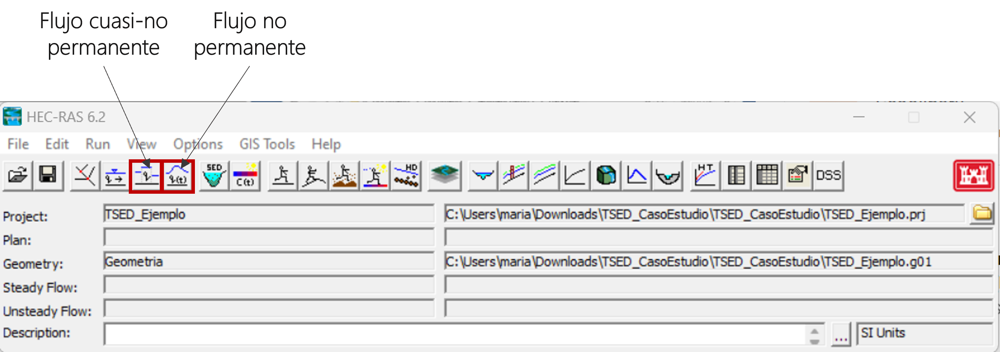

Entre los archivos descargados para desarrollar el caso de estudio, hay un archivo en Excel llamado _"Data"_, en la primera pestaña (_CaudalLiquido_) está la información de campo de caudales líquidos necesaria para la creación del archivo de caudales.

    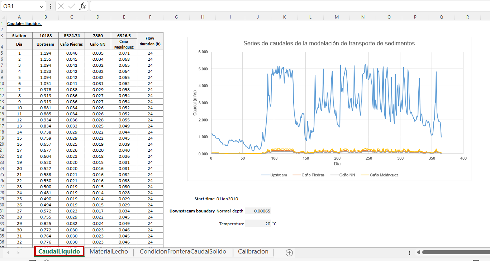

### Creación archivo flujo cuasi-no permanente

Se selecciona el ícono de flujo quasi-no permanente y se guarda el archivo de caudales. Por defecto, en el editor aparecen las secciones de aguas arriba y aguas abajo del tramo del río definido en la geometría debido a que independientemente del enfoque escogido, Hec-Ras necesita las condiciones de frontera aguas arriba y aguas abajo. Dependiendo de la ubicación de la estación, se habilitan diferentes condiciones de frontera.

    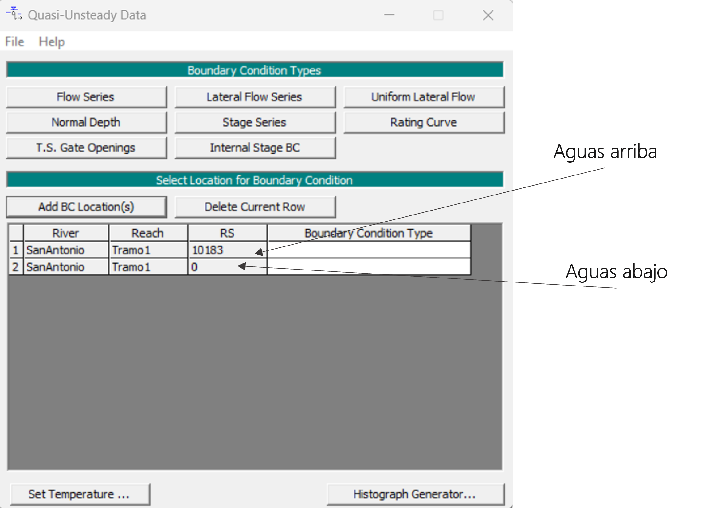

### Condición de frontera aguas arriba

Aguas arriba, la única condición de frontera que se habilita es ingresar una serie de caudales (_Flow Series_).

    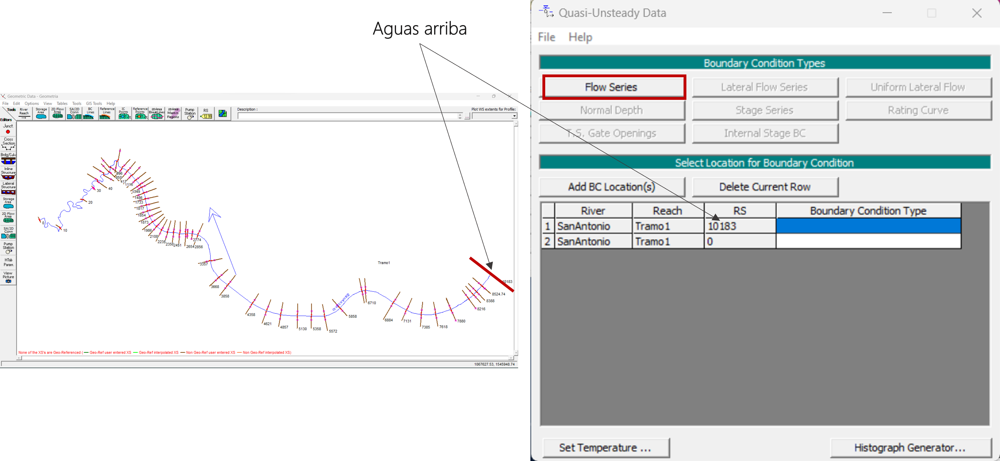

Al seleccionar esa opción se abre la ventada del editor de serie de caudales, esta ventana es muy similar al editor de hidrogramas en flujo no permanente.

    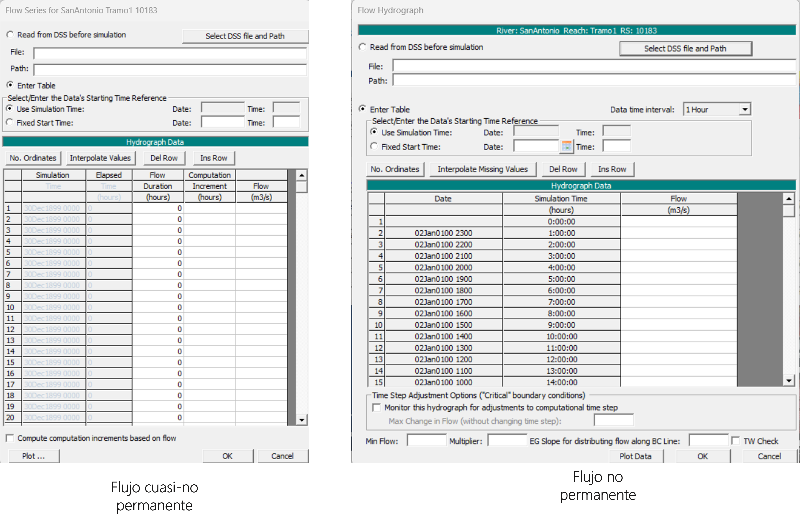

Para la fecha de inicio de la serie se puede utilizar la fecha de la simulación (_Simulation Time_), o lo que yo prefiero, una fecha de inicio fija (_Fixed Start Time_) debido a que si uno conoce las fechas de la serie que ingresa al programa, se puede modificar la ventana de tiempo de la simulación dependiendo del análisis que se desee realizar. La convención de fechas empleada por el programa es DDMMMYYYY, entonces, si nuestra serie empieza el 01 de enero del 2010 ingresamos 01Jan2010. La convención para el tiempo es HHMM.

    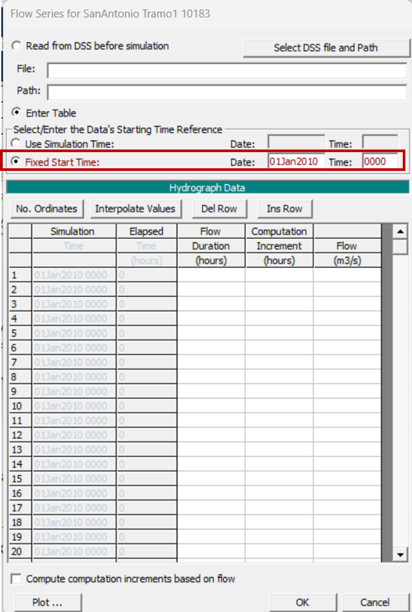

El editor de flujo cuasi-no permanente permite definir intervalos de tiempo irregulares (_Flow duration_). En nuestro caso de estudio tenemos una serie de caudales diarios, por lo que la duración de cada intervalo de tiempo es de 24 horas. Sin embargo, en el editor aparecen por defecto solamente 100 filas para ingresar datos, y nosotros necesitamos 365 filas, ya que la serie de datos es de un año, para modificar la cantidad de filas se selecciona el botón _No. Ordinates_ y se ingresan la cantidad de filas deseadas (máximo 40000 filas).

    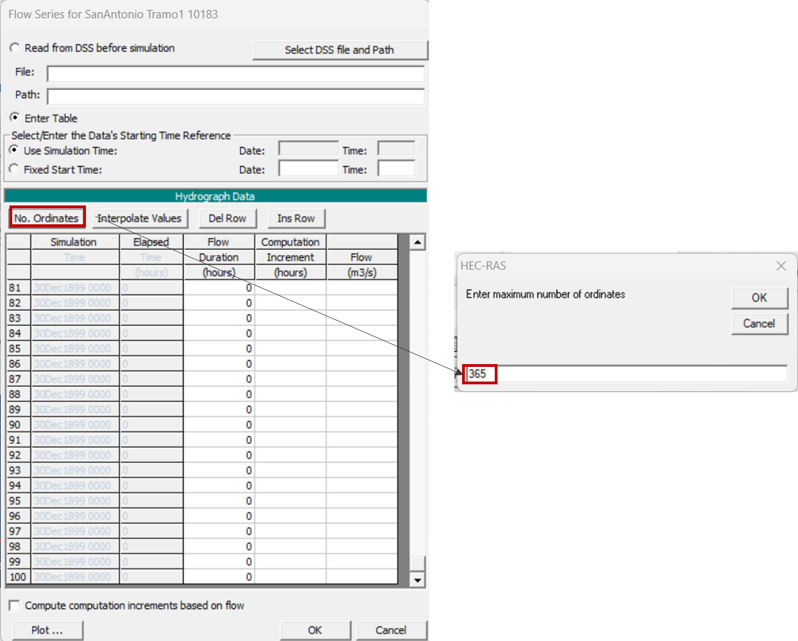

Para ingresar los valores de _Flow Duration_ podemos escribir el primer valor y arrastrarlo hacia abajo, o también podemos poner el valor en la primera y última fila y usar el botón _Interpolate Values_.

    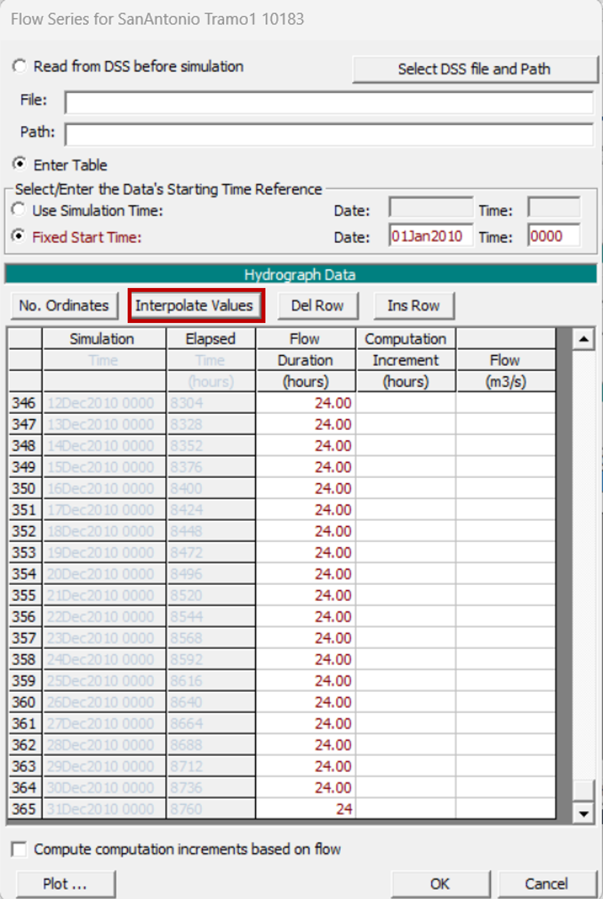

Ahora que tenemos los intervalos de tiempo diarios podemos ingresar la serie de caudales que aparece en el archivo de Excel. En el documento de Excel aparecen cuatro series de caudales, la primera, que tiene el nombre _"Upstream"_ es la serie de caudales para nuestra condición de frontera aguas arriba, las otras tres son las de los afluentes que llegan al Arroyo San Antonio, que más adelante les explicaré como ingresarlas. Copiamos los valores y los pegamos en el editor de Hec-Ras.

    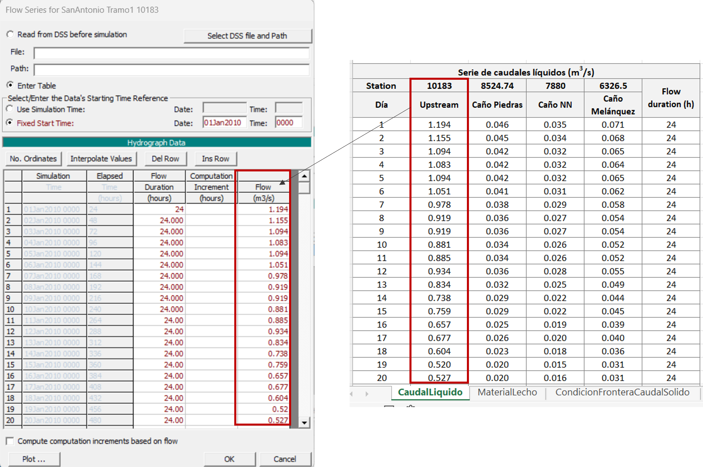

Nos falta completar la columna del incremento computacional (_Computational Increment_). La duración del flujo (_Flow Duration_) son los intervalos de tiempo en los que se tiene la información, mientras que el incremento computacional (_Computational Increment_) es el incremento de tiempo con el que Hec-Ras realiza los cálculos hidráulicos y simula el transporte de sedimentos. Hec-Ras es muy sensible a este valor debido a que dentro del incremento computacional asume que no hay cambios en el lecho, y los cambios (erosión o sedimentación) se asocian a la magnitud del caudal líquido, por lo que para caudales más altos preferiríamos tener incrementos computacionales más pequeños. El valor del incremento computacional (_Computational Increment_) no puede ser mayor que el de la duración del flujo (_Flow Duration_).

    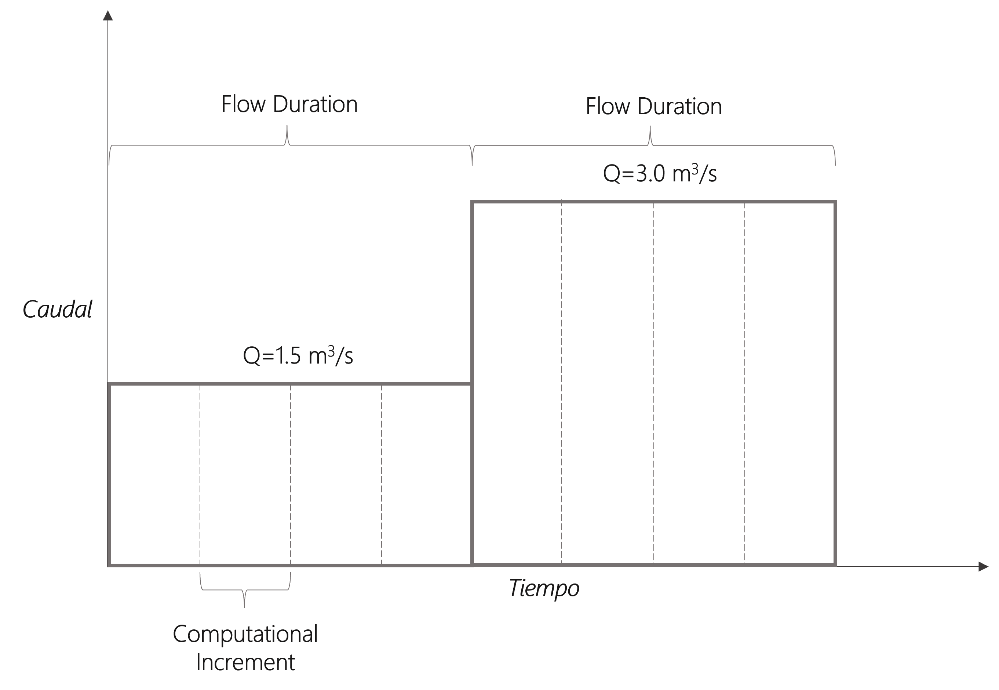

Se podría completar la información del incremento computacional ingresando el valor de este en cada una de las filas. Otra opción disponible es definir los incrementos computacionales basados en la magnitud del caudal. Al seleccionar la casilla se habilita una tabla en la que podemos definir el intervalo de caudales y el incremento computacional asociado.

    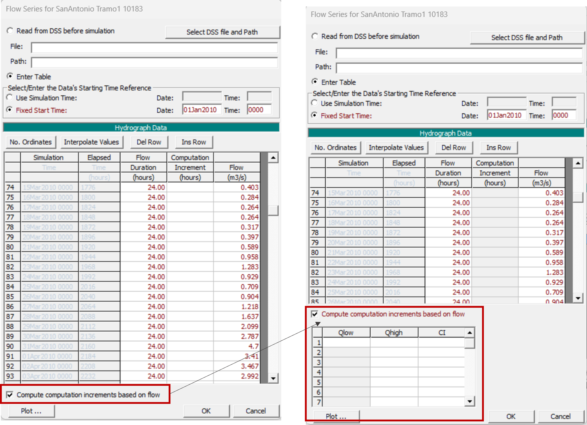

Escoger los incrementos computacionales es un trabajo de prueba y error, normalmente lo que se hace es ir disminuyendo el incremento computacional hasta que los resultados del modelo no
muestren una diferencia significativa. En este caso de estudio vamos a utilizar los incrementos computacionales mostrados en la siguiente figura.

El caudal máximo de la tabla ingresada debe ser mayor al caudal máximo de la serie analizada. Al introducir los valores en la tabla inferior, se va completando automáticamente la columna _Computation Increment_.

    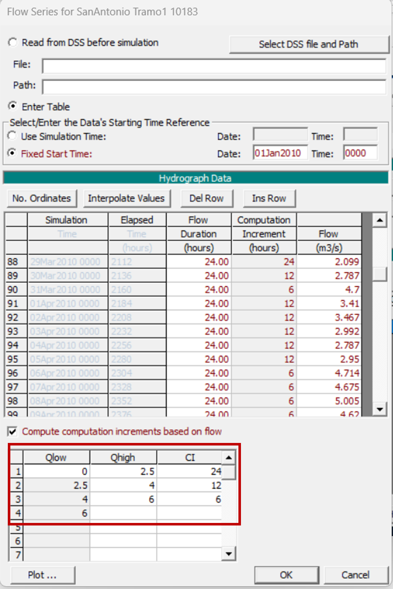

Seleccionamos el botón _Ok_ para guardar los datos ingresados.

    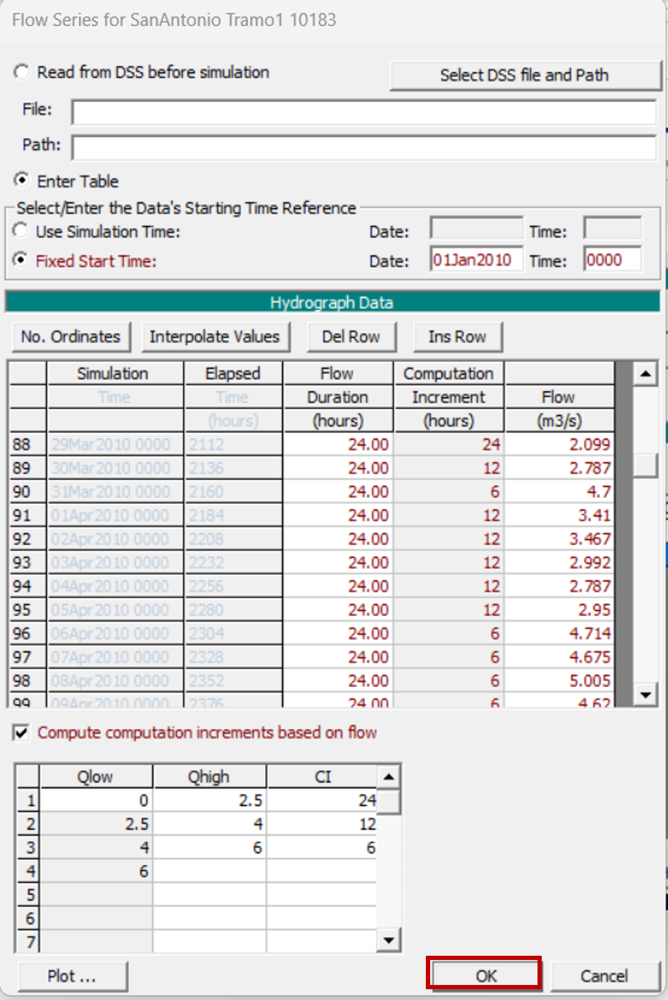

Ahora podemos volver a abrir el _Flow Series_ y al hacer click en el botón _Plot_ se muestra la gráfica de la serie de caudales ingresada.

    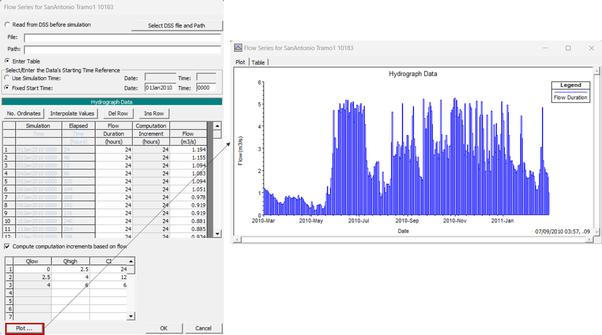

### Condición de frontera aguas abajo

Aguas abajo, se habilitan tres opciones de condición de frontera:
* _Normal Depth_: profundidad normal
* _Stage Series_: serie de elevaciones de la superficie libre del agua
* _Rating Curve_: curva de calibración (caudal vs. elevación de la superficie libre)

    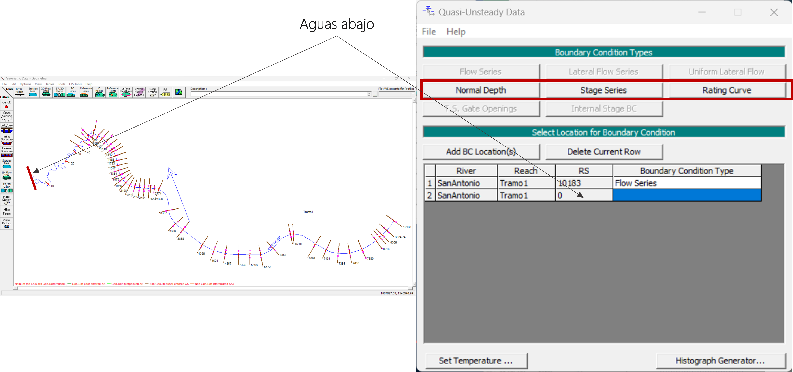

Para el caso de estudio vamos a utilizar la profundidad normal, lo que hace esta condición es calcular la profundidad de flujo utilizando la ecuación de Manning, para esto solamente necesita el valor de la pendiente de fricción, que básicamente sería la pendiente del cauce.

    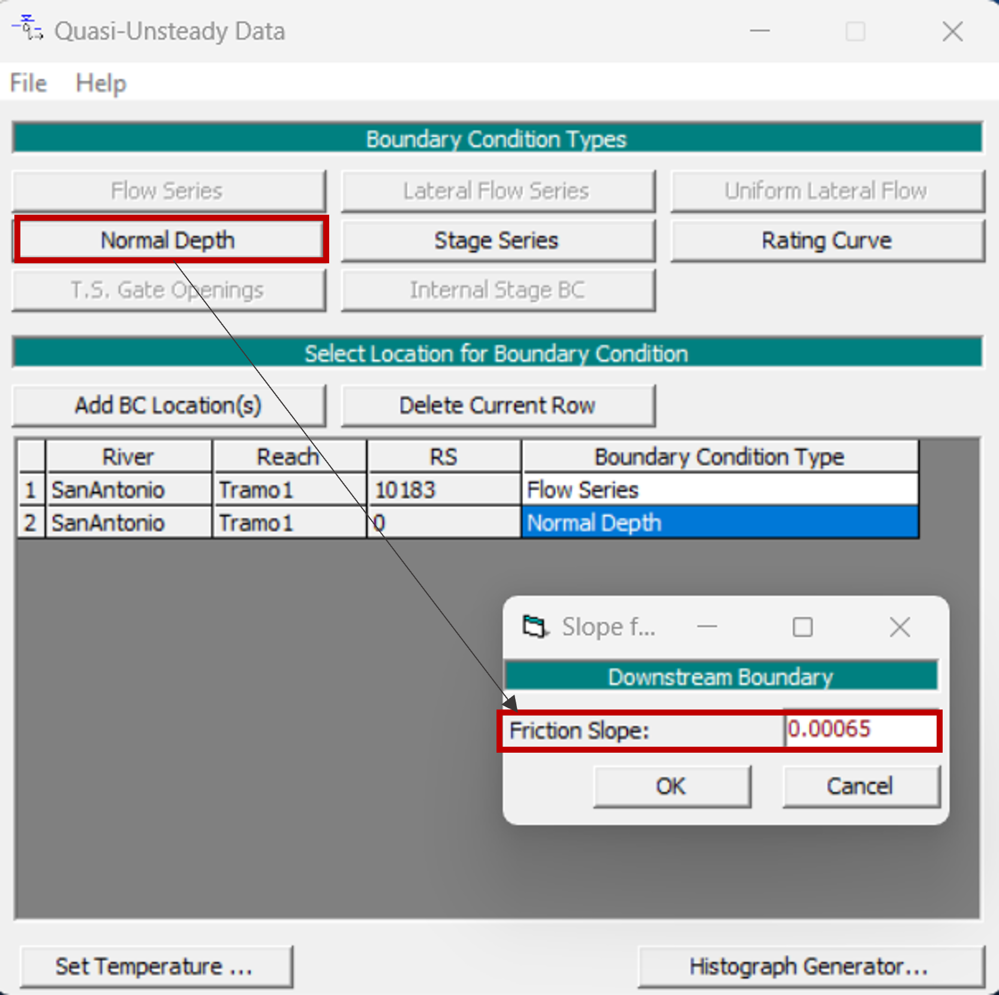

### Datos de temperatura

En los modelos de transporte de sedimentos se necesita también de información de la temperatura del agua, ya que la velocidad de caída y algunas ecuaciones de transporte de sedimentos son sensibles a la viscosidad del agua, que es función de su temperatura.

Seleccionamos el botón que aparece en la esquina inferior izquierda _Set Temperature_ y nos abre el editor de series de temperatura.

    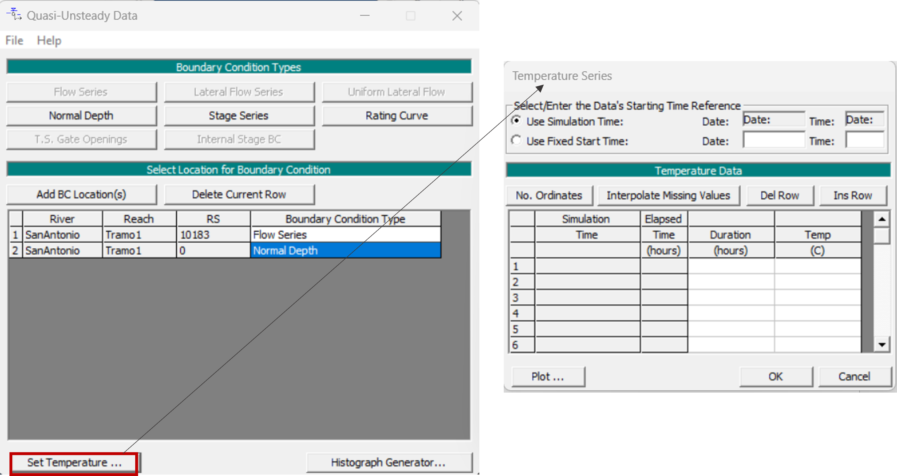

Al igual que hicimos con la serie de caudales de la condición de frontera aguas arriba, vamos a utilizar una fecha fija de inicio. Se puede tener series de temperatura en la que el valor dela temperatura del agua cambia en el tiempo, sin embargo, en nuestro caso de estudio tenemos un valor constante de temperatura, por lo que podemos ingresar en una fila el valor de temperatura que tenemos y asignarle una duración equivalente a un año, que es la duración de nuestra serie de caudales.

    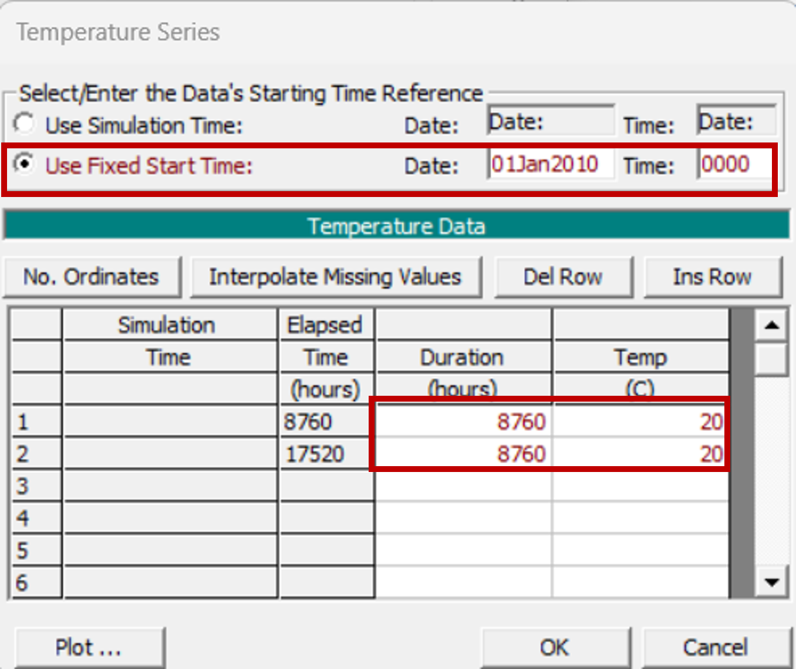

Seleccionamos _Ok_ y guardamos nuestro archivo de caudales.

### Afluentes/tributarios

Si nuestro río no tuviese afluentes, ya tendríamos listo nuestro archivo de caudales. Sin embargo, sabemos que al tramo del Arroyo San Antonio que estamos modelando le llegan tres afluentes. Para considerar en el modelo los afluentes debemos agregar una serie de caudales laterales _Lateral Flow Series_ para cada uno de ellos.

Los enfoques de flujo cuasi-no permanente y flujo no permanente incluye en el modelo el caudal lateral aguas abajo de la sección transversal especificada, lo mismo ocurre para la carga de sedimentos. Por ejemplo, digamos que aguas arriba tenemos un caudal de 10 m3/s y en la abscisa 200 definimos un caudal lateral de 5 m3/s, el $/delta$Q se verá reflejado en la abscisa 100.

    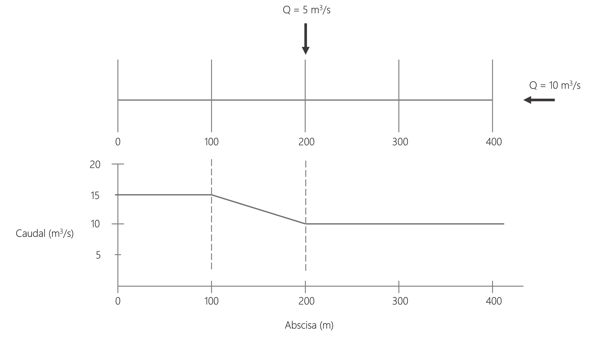

Entonces, si queremos incluir un afluente, debemos ingresar el caudal en la sección aguas arriba de donde realmente está el afluente. Los afluentes de nuestro caso de estudio los definiremos en las siguientes estaciones:

* Caño Piedras: Station 8524.74
* Caño NN: Station 7880
* Caño Melánquez: Station 6326.5

Abrimos nuevamente el editor de flujo cuasi-no permanente, seleccionamos el botón _Add BC Location(s)_ y añadimos las estaciones que necesitamos.

    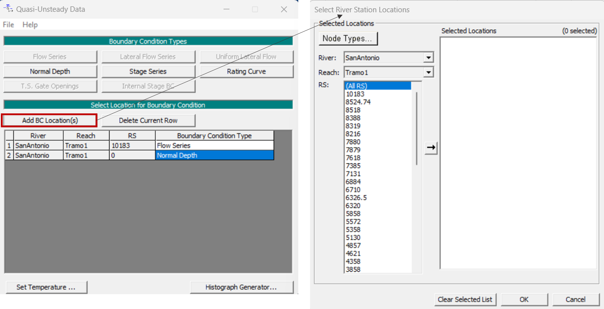

Para seleccionar las estaciones (_River Station_) se buscan en la columna de la izquierda y se hace click en la flecha indicada en el recuadro rojo, después de seleccionar las tres estaciones se hace click en _Ok_ para cerrar la ventana.

    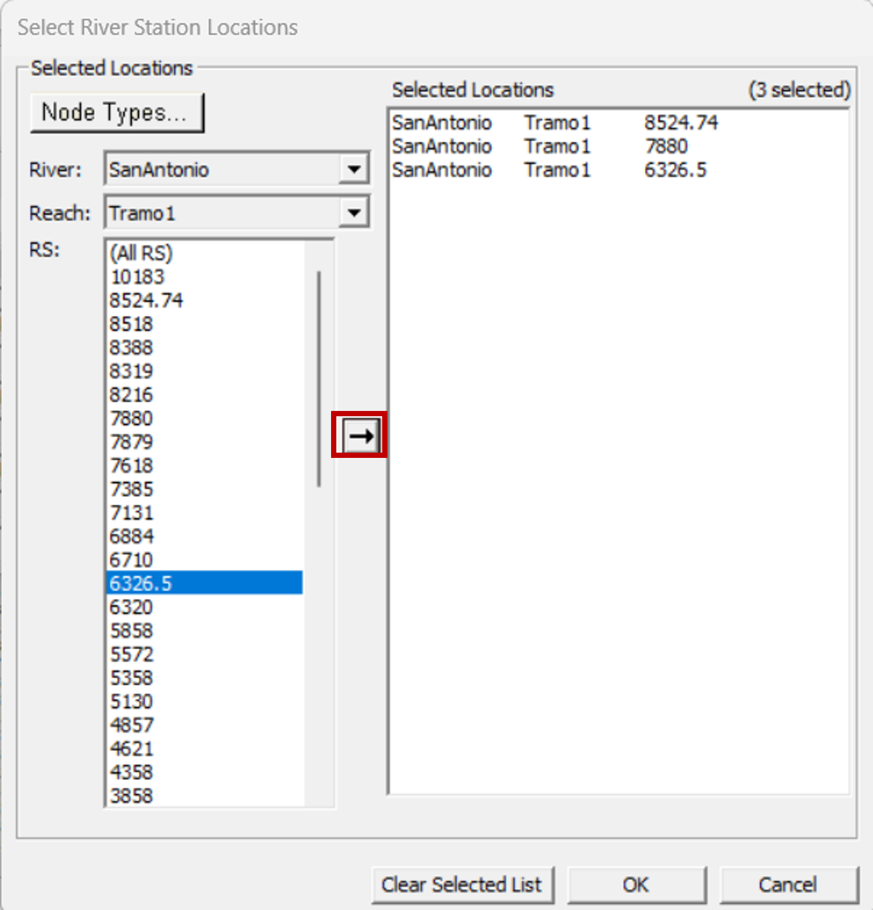

Para cada una de las nuevas estaciones que añadimos vamos a definir una serie de caudales lateral _Lateral Flow Series_.

    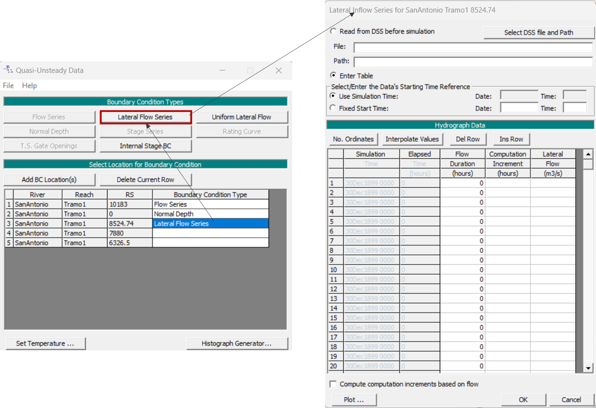

Completamos la información con las series de caudales que aparecen en el archivo de Excel. Como seleccionamos la estación 8524.74, ingresamos los datos de la columna llamada "Caño Piedras". Como estos tributarios tienen un caudal relativamente bajo, utilizaremos un incremento computacional constante de 24 horas. Recuerden que debemos definir nuevamente la cantidad de filas que necesitamos.

    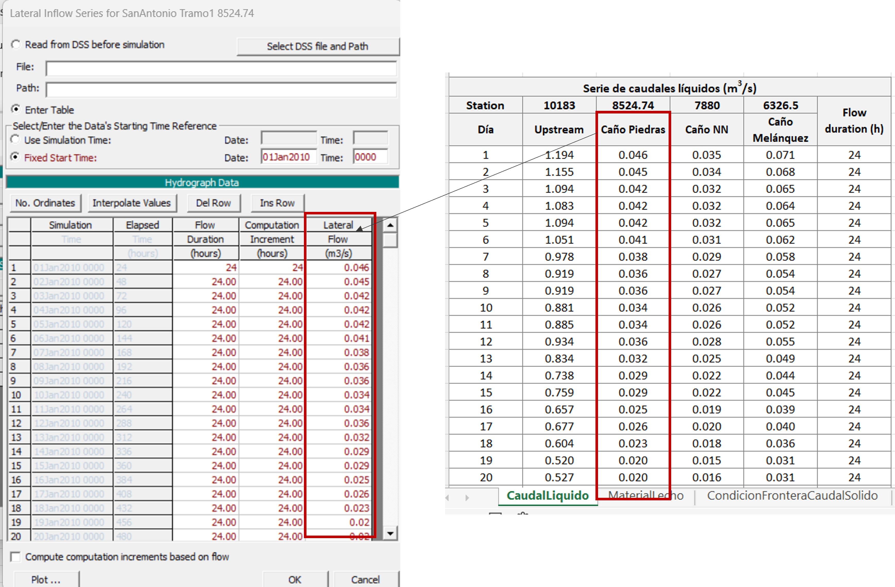

Seleccionamos _Ok_ y repetimos el procedimiento para los otros dos tributarios restantes.

    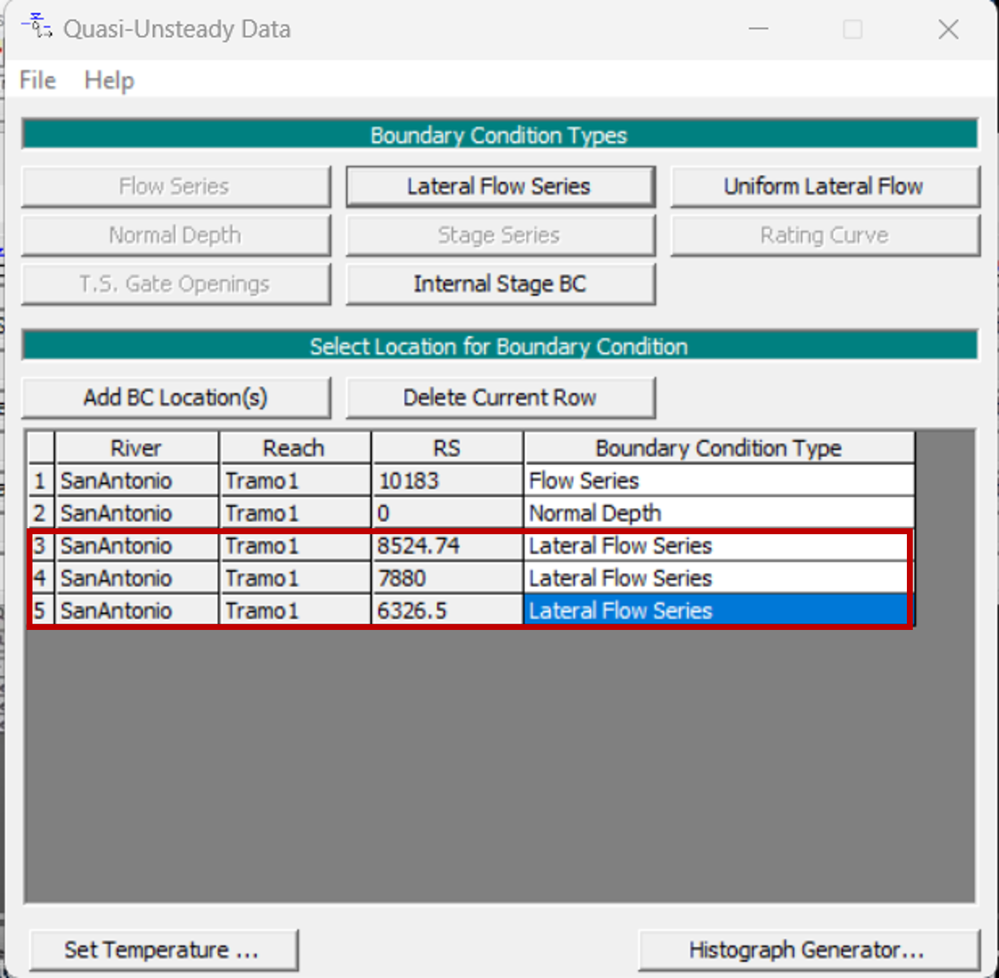

Guardamos el archivo de caudales y ya lo tendríamos listo para proceder con la siguiente actividad, en la que ingresaremos la información de sedimentos.

    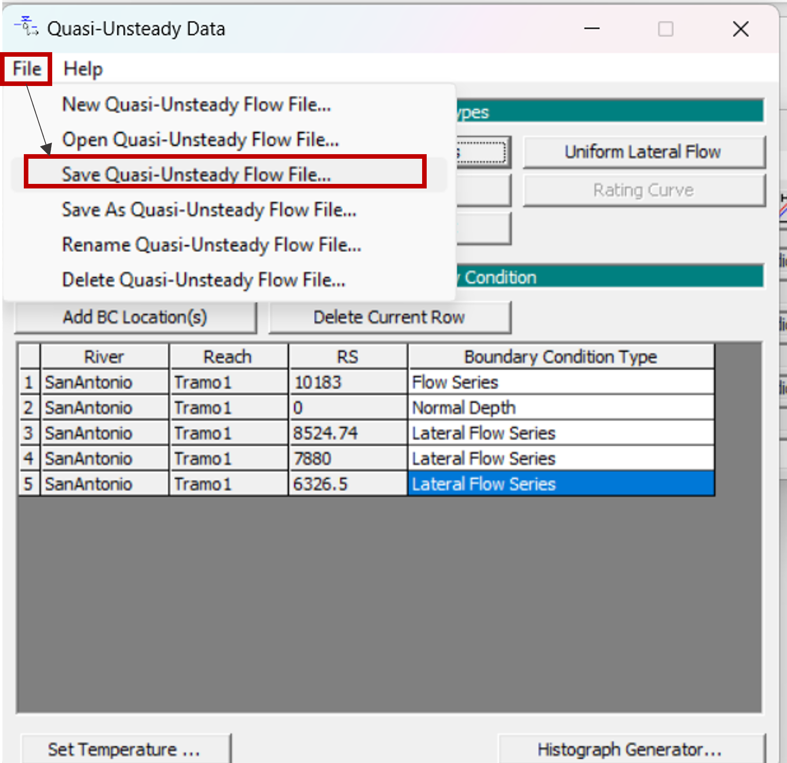

En la ventana principal de Hec-Ras se puede observar que ya tenemos el arhcivo de geometría y el archivo de caudales (_Quasi Unsteady_)

    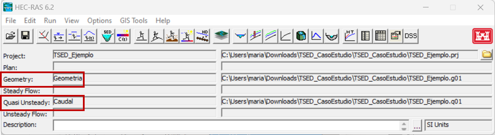

### Licencia, cláusulas y condiciones de uso

M.TSED es de uso libre para fines académicos, conoce nuestra licencia, cláusulas, condiciones de uso y como referenciar los contenidos publicados en este repositorio, dando [clic aquí](https://github.com/mflatouche/M.TSED/wiki/License).

| [Anterior]() | [:house: Inicio](../../README.md) | [:beginner: Ayuda]() | [Siguiente]() |
|--------------|-----------------------------------|----------------------|---------------|

[^1]: Hydrologic Engineering Center. (s.f.). Hydrologic Engineering Center's (CEIWR-HEC) River Analysis System (HEC-RAS). Obtenido de 1D Sediment Transport User's Manual Manual: https://www.hec.usace.army.
