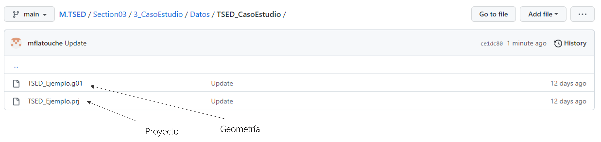
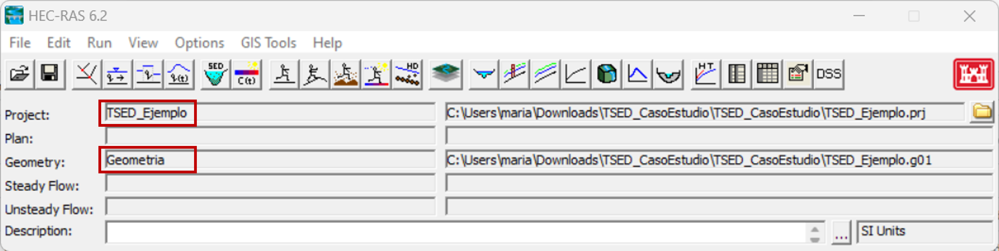
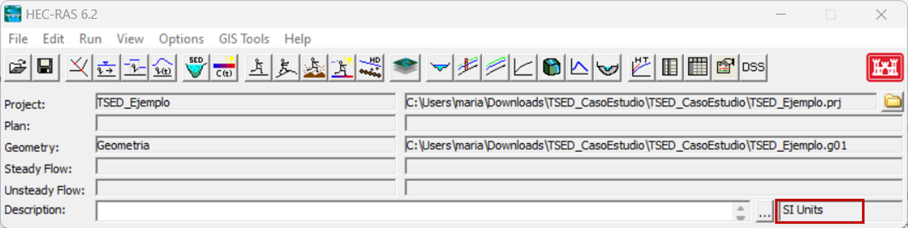
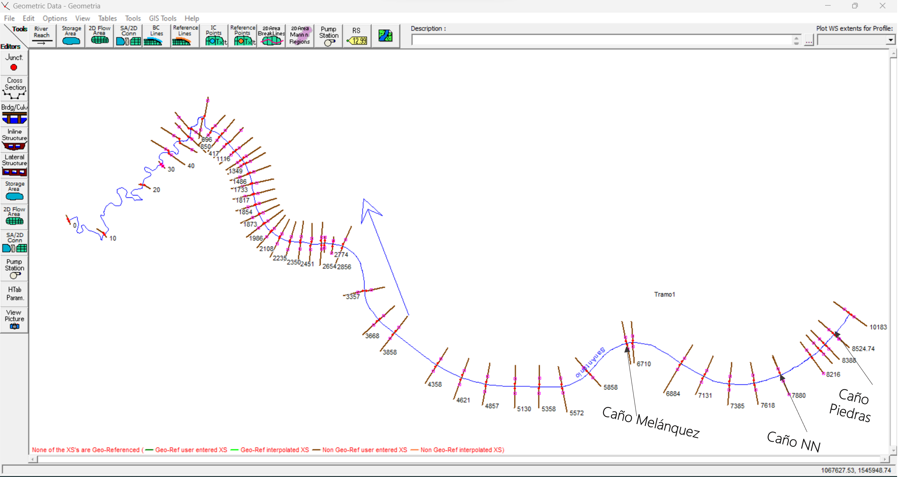
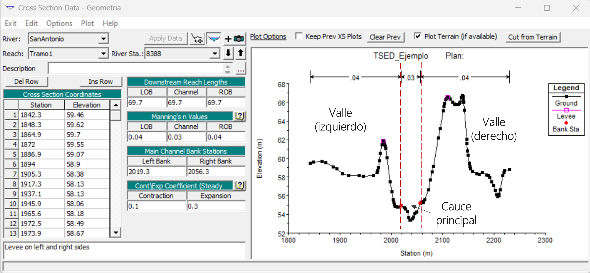

## Geometría
Keywords: `Sediment transport` `Geometry file` 

    

### Archivo de geometría

En la actividad anterior está disponible el link para descargar los datos necesarios para desarrollar el caso de estudio. Como se mencionó anteriormente, se necesitan tres archivos para crear un modelo de transporte de sedimentos: geometría, caudales y sedimentos, y un plan que los acople entre sí.

En los archivos descargados van a encontrar dos archivos de Hec-Ras, uno es el proyecto y otro es la geometría del cauce que se va a analizar. Los coeficientes de rugosidad de Manning para esta geometría ya fueron calibrados previamente utilizando simulaciones con flujo permanente, se va a partir de esta geometría conocida para desarrollar el modelo de transporte de sedimentos.

    

En este curso se utilizará Hec-Ras 6.2 para desarrollar el caso de estudio. Desde el programa Hec-Ras se abre el archivo del proyecto (_TSED_Ejemplo.prj_) y automáticamante también se carga el archivo de geometría que se encuentra en la carpeta.

    

En la esquina inferior derecha de la ventana del software se pueden revisar las unidades en las que está el proyecto, estaremos trabajando con el Sistema Internacional de unidades.

    

Al abrir la ventana _"Geometric Data"_ encuentran el archivo de geometría de un modelo unidimensional, consiste en 55 secciones transversales a lo largo del tramo en estudio del Arroyo San Antonio. Los afluentes se encuentran entre las siguientes estaciones:

* Caño Piedras: Station 8524.74 y Station 8518
* Caño NN: Station 7880 y Station 7879
* Caño Melánquez: Station 6326.5 y Station 6320 

    

En el ícono _"Cross Section"_ se pueden ver cada una de las secciones transversales del modelo. El cauce principal tiene asignado un coeficiente de rugosidad de Manning de 0.03 y el valle tiene un coeficiente de 0.04.

    

Con la geometría definida, procederemos en la siguiente actividad a generar el archivo de caudales.

### Licencia, cláusulas y condiciones de uso

M.TSED es de uso libre para fines académicos, conoce nuestra licencia, cláusulas, condiciones de uso y como referenciar los contenidos publicados en este repositorio, dando [clic aquí](https://github.com/mflatouche/M.TSED/wiki/License).

| [Anterior](../3_CasoEstudio) | [:house: Inicio](../../README.md) | [:beginner: Ayuda]() | [Siguiente](../3_Caudal) |
|------------------|-----------------------------------|----------------------|-------------------|

[^1]: Hydrologic Engineering Center. (s.f.). Hydrologic Engineering Center's (CEIWR-HEC) River Analysis System (HEC-RAS). Obtenido de 1D Sediment Transport User's Manual Manual: https://www.hec.usace.army.

[^2]: Gibson, S. (5 de Junio de 2019). _Intro HEC-RAS Sediment Demo (Part 1 of 3 - Quasi-Unsteady Flow)_. Obtenido de https://www.youtube.com/watch?v=d416442IC4c

[^3]:Gibson, S. (5 de Junio de 2019). _Intro HEC-RAS Sediment Demo (Part 2 of 3 - Sediment Transport Data)_. Obtenido de https://www.youtube.com/watch?v=9YiL3Men9as&t=609s

[^4]:Gibson, S. (10 de Junio de 2019). _Intro to HEC-RAS Sediment Demo (Part 3 of 3 - Simulation and Output)_. Obtenido de https://www.youtube.com/watch?v=X9xikwi0v-U&t=225s

