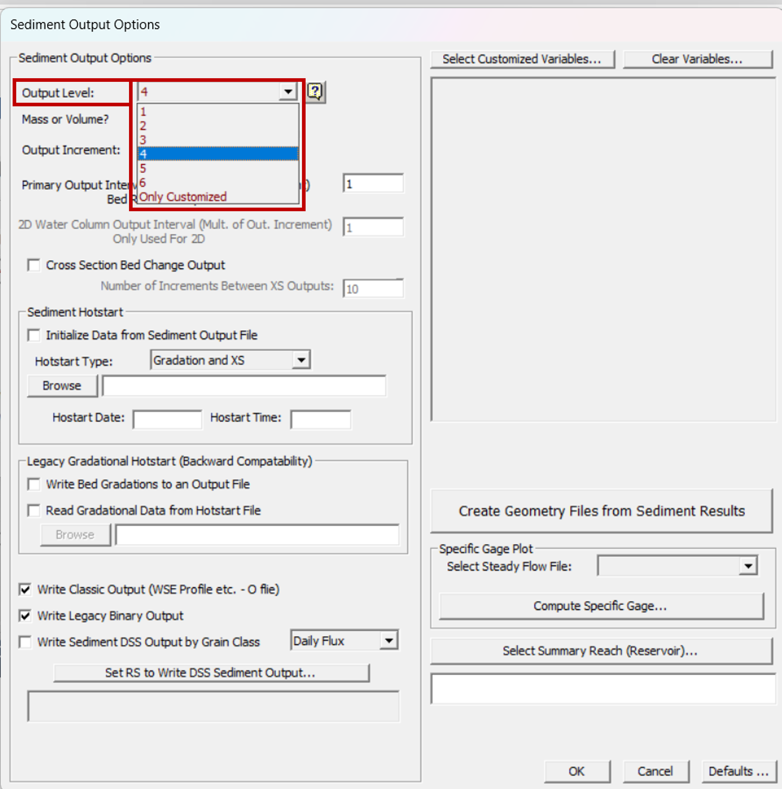

## Plan de transporte de sedimentos
Keywords: `Sediment transport` 

    

### Creación del plan de transporte de sedimentos para flujo cuasi-no permanente

En las actividades anteriores creamos el archivo de geometría, el archivo de caudales y el archivo de sedimentos, ahora solo nos falta crear el plan de transporte de sedimentos que relacione los tres archivos y permita ejecutar el modelo.

    

Vamos a crear el plan de transporte de sedimentos seleccionando el botón indicado en la siguiente figura.

    

Se abrirá la ventana _Sediment Transport Analysis_, en esa ventana se escogen los archivos de geometría, caudal y sedimentos que se van a utilizar en el plan.

    

Se guarda el plan, se le asigna un nombre y un identificativo más corto:

    

Se debe establecer una fecha de inicio y fin para la simulación, es importante que la información de las series de caudales, temperatura, sedimentos, ect. que se hayan creado sean lo suficientemente extensas para abarcar toda la ventana de tiempo de la simulación. En el caso de estudio vamos a realizar la simulación de un año, empezando el 01Jan2010 0000 y finalizando el 31Dec2010 0000.

    

Con esta información ya se podría ejecutar el modelo de transporte de sedimentos, sin embargo, antes vamos a modificar las opciones de los resultados del análisis de sedimentos (_Sediment Output Options_).

#### Sediment Output Options

    

Primero vamos a enfocarnos en las tres primeras opciones:

    

* **Output Level**: puede ser un valor del 1 al 6, mientras mayor sea el número mayor será la cantidad de información y parámetros que se muestren en los resultados. El _Output Level_ 3 es el valor por defecto, la diferencia entre el nivel 3 y el 4 básicamente es que la información se muestra por cada intervalo de clase de la granulometría del lecho. En el siguiente link se encuentra detallado cada una de las variables de los niveles de resultado [Output Level](https://www.hec.usace.army.mil/confluence/rasdocs/rassed1d/1d-sediment-transport-user-s-manual/simulating-sediment-transport/sediment-output-options-and-tolerances/output-level). Para el caso de estudio voy a seleccionar el nivel 4 para mostrarles los resultados por cada tamaño de partícula.

    

* **Mass or Volume?**: Hec-Ras calcula los resultados del transporte de sedimentos en unidades de masa, pero puede convertir los resultados a unidades de volumen dividiendo la masa por el peso unitario del material (el cual es diferente para arcilla, limo y material granular). Generalmente, se utilizan los resultados en términos del volumen para calibrar el modelo, ya que la información que generalmente se tiene es batimetrías históricas, las cuales se pueden convertir a cambio en volumen multiplicando la diferencia del área por la longitud del tramo del volumen de control. Vamos a seleccionar _Volume_ en esta casilla.

    

* **Output Increment**: permite escoger con que frecuencia se quiere que se muestren los resultados, Hec-Ras permite escoger entre cuatro opciones (Incremento computacional, Duración del flujo, Horas, Días) las primeras dos opciones pueden ser intervalos de tiempo variables, dependiendo de cómo se hayan establecido en la serie de tiempo de caudales, y las últimas dos son intervalos de tiempo fijos. En nuestro caso de estudio quiero que me muestren los resultados cada día, como nuestra serie de caudales era una serie de caudales diarios, podría escoger _Flow Duration_ o _Days_ para que me muestren los resultados diarios.

    

Por último, revisemos la opción de _Cross Section Bed Change Output_. Voy a seleccionar la casilla indicada en la figura, lo cual va a asegurar que obtenga los resultados de las secciones transversales del modelo, por defecto no se muestran estos resultados debido a que ocupan una gran cantidad de memoria. El múltiplo que aparece en la casilla significa que se mostrarán resultados de secciones transversales cada 10 resultados del perfil.

    

Seleccionamos _OK_ y luego _Compute_ para ejecutar el modelo.

    

Aparecerá una ventana en la que se va mostrando el avance de la ejecución del modelo, cuando finalice de realizar las simulaciones en la parte superior aparecerá _HEC-RAS Finished Computations_, seleccionamos el botón _Close_.

    

Ahora que ya también creamos el plan y lo ejecutamos, veremos en la siguiente actividad los resultados del modelo.

    

### Licencia, cláusulas y condiciones de uso

M.TSED es de uso libre para fines académicos, conoce nuestra licencia, cláusulas, condiciones de uso y como referenciar los contenidos publicados en este repositorio, dando [clic aquí](https://github.com/mflatouche/M.TSED/wiki/License).

| [Anterior](../3_Sedimentos) | [:house: Inicio](../../README.md) | [:beginner: Ayuda]() | [Siguiente](../3_Resultados) |
|------------------|-----------------------------------|----------------------|-------------------|

[^1]: Federal Agency Stream Restoration Working Group. (2001). _Stream Corridor Restoration: Principles, Processes, and Practices_. FISRWG.

[^2]: Gibson, S. (5 de Junio de 2019). _Intro HEC-RAS Sediment Demo (Part 1 of 3 - Quasi-Unsteady Flow)_. Obtenido de https://www.youtube.com/watch?v=d416442IC4c

[^3]:Gibson, S. (5 de Junio de 2019). _Intro HEC-RAS Sediment Demo (Part 2 of 3 - Sediment Transport Data)_. Obtenido de https://www.youtube.com/watch?v=9YiL3Men9as&t=609s

[^4]:Gibson, S. (10 de Junio de 2019). _Intro to HEC-RAS Sediment Demo (Part 3 of 3 - Simulation and Output)_. Obtenido de https://www.youtube.com/watch?v=X9xikwi0v-U&t=225s

