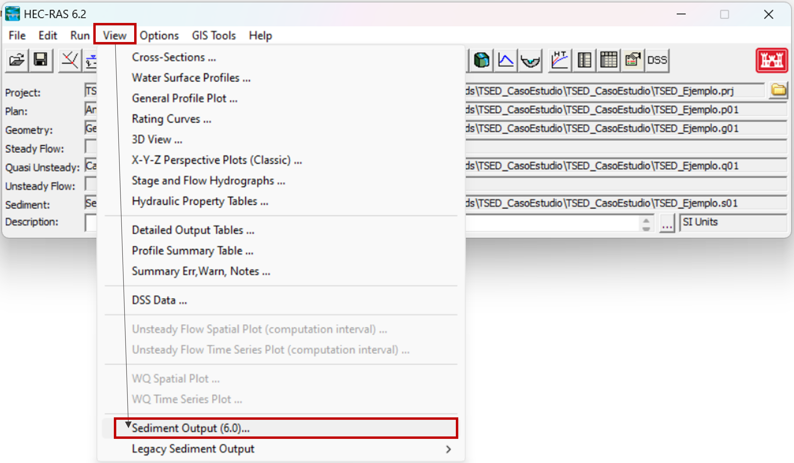

## Visualización e interpretación de resultados
Keywords: `Sediment transport` 

    

Para ver los resultados del modelo de transporte de sedimentos seleccionamos View-> Sediment Output (6.0)...

    

La ventana de resultados de Sedimentos se muestra en la siguiente figura. Básicamente, hay tres tipos de resultados que nos interesa analizar: series de tiempo, perfil y secciones transversales.

    

Empezaremos revisando los resultados del perfil _Profile_.

### Perfil (_Profile_)

Cuando se selecciona el modo _Profile_ en el recuadro superior aparecen las variables a analizar y en el recuadro inferior la fecha de la simulación en la que se quieren ver los resultados.

    

Entre las variables que más nos interesan analizar están:

#### Invert Elevation

Es el perfil longitudinal del cauce. Voy a seleccionar en el recuadro superior _Invert Elevation_ y voy a escoger en el recuadro inferior que Hec-Ras me muestre el perfil al inicio de la simulación (01Jan2010 0000) y al final de la simulación (31Dec2010 0000). En la parte derecha de la ventana se muestra la leyenda de los datos seleccionados.

    

Hec-Ras permite ver los resultados como gráficas (_Plot_) o como tablas (_Table_). Los resultados de las tablas se pueden seleccionar y copiar, para luego guardarlos en una hoja de cálculo.

    

Volviendo a la gráfica podemos ver que en el tramo inicial del cauce descendió la cota del lecho y en el tramo final aumentó, el valor neto de este cambio lo podemos ver con la variable _Invert Change_.

    

#### Invert Change

eEs el cambio de la elevación de la cota del fondo desde el inicio de la simulación. Si el signo es positivo significa que hubo sedimentación y si el cambio es negativo, es que se presentó erosión en el cauce principal.

    

#### Vol Bed Change Cum

Otra forma de ver los resultados, es evaluando el cambio en volumen del lecho. Lo que hace esta variable es evaluar el volumen sedimentado (+) o eriosonado (-) de cada sección transversal para la fecha de simulación seleccionada. 

La línea en color vinotinto representa el volumen de todos los tamaños de partículas, y las siguientes corresponden a cada intervalo de clase de las partículas por separado.

    

Efectivamente, el tramo inicial del cauce presenta erosión y el tramo final sedimentación.

    

#### Long. Cum Vol Change

Otro análisis que puede interesar, es cual es el cambio en volumen del lecho de todo el sistema, para esto utilizamos la variable _Long. Cum Vol Change_. Esta variable lo que hace es acumular desde aguas arriba hacia aguas abajo el cambio total del volumen del lecho de cada sección desde el inicio de la simulación hasta la fecha escogida.

    

La gráfica muestra que aguas arriba se está erosionando (pendiente negativa) y aguas abajo sedimentando (pendiente positiva), sin embargo, en el sistema se presentan mayores procesos de erosión que de sedimentación, ya que en la abscisa 0 el valor del balance en volumen de todo el sistema es negativo.

### Secciones transversales (_Cross Sections_)

Ahora vamos a ver los resultados que aparecen en las secciones transversales. Cuando se selecciona el modo _Cross Sections_ en el recuadro inferior aparecen los nombres de las estaciones (secciones transversales) que ingresamos en la geometría del modelo, y en el recuadro superior la fecha de la simulación en la que se quieren ver los resultados.

    

Voy a seleccionar que me muestre la estación 6320 al inicio de la simulación (01Jan2010 0000) y al final de la simulación (31Dec2010 0000). Podemos ver que en esa estación hubo erosión del cauce principal.

    

### Series de tiempo (_Time Series_)

Las series de tiempo permiten ver en una sección transversal dada, cómo fue cambiando alguna de las variables escogidas en el tiempo. Cuando se selecciona el modo _Time Series_ en el recuadro inferior aparecen los nombres de las estaciones (secciones transversales) que ingresamos en la geometría del modelo, y en el recuadro superior aparecen las variables a analizar.

    

Digamos que queremos analizar en la misma estación anterior (6320) el cambio en la cota del fondo del canal (_Invert Change_) en el tiempo. Aunque en el resultado de _Cross Sections_ vimos que al final de la simulación hubo erosión en el cauce principal, en la serie de tiempo vemos que al inicio de la simulación hubo sedimentación y luego empezó a erosionarse el cauce principal.

    

Con esta guía, les recomiendo que revisen las variables que aparecen en la ventada de resultados de Sedimentos y hagan sus propios análisis. En la siguiente actividad les explicaré una de las tantas maneras en las que se puede ralizar la calibración dle modelo.

### Licencia, cláusulas y condiciones de uso

M.TSED es de uso libre para fines académicos, conoce nuestra licencia, cláusulas, condiciones de uso y como referenciar los contenidos publicados en este repositorio, dando [clic aquí](https://github.com/mflatouche/M.TSED/wiki/License).

| [Anterior](../3_Plan) | [:house: Inicio](../../README.md) | [:beginner: Ayuda]() | [Siguiente](../3_Calibracion) |
|------------------|-----------------------------------|----------------------|-------------------|

[^1]: Federal Agency Stream Restoration Working Group. (2001). _Stream Corridor Restoration: Principles, Processes, and Practices_. FISRWG.

[^2]: Gibson, S. (5 de Junio de 2019). _Intro HEC-RAS Sediment Demo (Part 1 of 3 - Quasi-Unsteady Flow)_. Obtenido de https://www.youtube.com/watch?v=d416442IC4c

[^3]:Gibson, S. (5 de Junio de 2019). _Intro HEC-RAS Sediment Demo (Part 2 of 3 - Sediment Transport Data)_. Obtenido de https://www.youtube.com/watch?v=9YiL3Men9as&t=609s

[^4]:Gibson, S. (10 de Junio de 2019). _Intro to HEC-RAS Sediment Demo (Part 3 of 3 - Simulation and Output)_. Obtenido de https://www.youtube.com/watch?v=X9xikwi0v-U&t=225s

