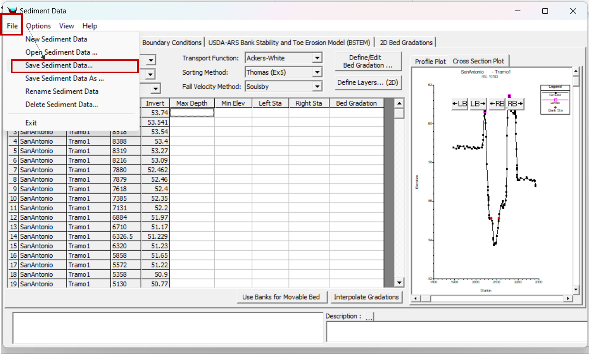
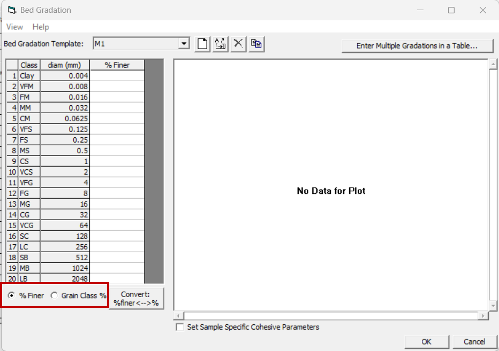
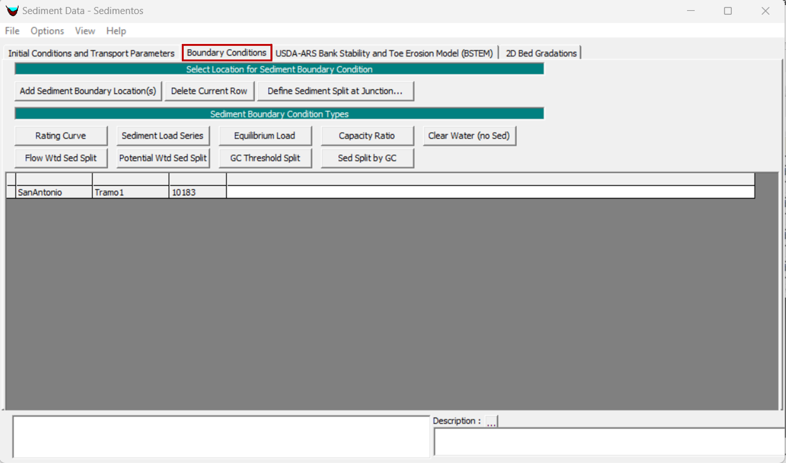

## Sedimentos
Keywords: `Sediment transport` `Sediment file`

### Archivo de sedimentos

Después de haber creado el archivo de geometría y el archivo de caudales, podemos comenzar con el archivo de sedimentos. Para esto seleccionamos el botón _Sediment Data_.

    

En el editor de información de sedimentos aparecen cuatro pestañas, de las cuales solamente utilizamos las primeras dos para la modelación unidimensional:

* Condiciones iniciales y parámetros de transporte (_Initial Conditions and Transport Parameters_)
* Condiciones de frontera (_Boundary Conditions_)

    

Guardamos el archivo de sedimentos y se define el nombre deseado. Este archivo lo llamaré "Sedimentos".

    

### Condiciones iniciales y parámetros de transporte (_Initial Conditions and Transport Parameters_)

En la pestaña _Initial Conditions and Transport Parameters_ aparece una tabla con cada una de las secciones transversales definidas en la geometría, el tramo y el río al que pertenecen y la elevación del fondo del cauce en cada sección.

    

#### Maximum Depth/Minimum Elev

Debemos definir el volumen de control que contiene sedimento que puede ser erosionado. Para definir la altura del volumen de control se debe especificar la máxima profundidad (_Max Depth_) o la mínima elevación (_Min Elev_), solamente se puede definir en cada sección alguna de las dos opciones. La mínima elevación define una cota fija hasta la que se puede erosionar, esta opción se utiliza cuando se sabe a qué altura está un estrato de roca, sin embargo, en cauces aluviales, es más común utilizar la máxima profundidad que se puede erosionar.

    

En nuestro caso de estudio, vamos a empezar con una máxima profundidad de 5 m (_Max Depth_) en todas las secciones transversales, esto significa que vamos a dejar que el lecho se erosione hasta 5 m por debajo de la cota del fondo del cauce, si luego es necesario aumentar este valor se puede modificar posteriormente. Escribimos el valor en la primera fila y la arrastramos hacia abajo para llenar la columna.

    

#### Movable Bed

Para terminar de definir el volumen de control de sedimentos se necesita la extensión horizontal en la que se va a permitir que haya erosión.

    

El botón _Use Banks for Movable Bed_ permite definir como los límites del lecho móvil (límites erosionables) las bancas que delimitan el cauce principal.

    

En la gráfica de la derecha de la ventana se ve en línea punteada el potencial de erosión asociado a la sección transversal que se tenga seleccionada.

    

#### Bed Gradation

El siguiente paso que debemos hacer es definir la granulometría del material del lecho asociada a cada sección transversal. Normalmente, no se tienen muestras del material del lecho en cada una de las secciones transversales, pero en Hec-Ras hay opciones que permiten interpolar estas granulometrías o definir la misma granulometría en múltiples secciones.

En el archivo en Excel llamado _"Data"_, en la segunda pestaña (_MaterialLecho_) está la granulometría del material del lecho de cuatro muestras diferentes y la sección transversal en las que fueron tomadas. El material del lecho del Arroyo San Antonio es predominantemente del tamaño de arenas y gravas.

    

Para ingresar las curvas granulométricas al modelo Hec-Ras seleccionamos el botón _Define/Edit Bed Gradation_ para definir lo que llaman "plantillas" de granulometría.

    

En el editor de _Bed Gradation_ seleccionamos el botón que parece una hoja en blanco para crear una nueva plantilla, ingresamos el nombre de esa muestra y seleccionamos el botón _OK_.

    

Hec-Ras permite introducir la granulometría del lecho como porcentaje que pasa (_%Finer_) o como porcentaje retenido entre los tamices (_Grain Class%_). Es más común que los laboratorios den los resultados en porcentaje que pasa, y en ese formato es que tenemos la información de nuestro caso de estudio, por lo que vamos a dejar seleccionada esa opción.

    

Luego, copiamos los datos que tenemos en el archivo de Excel y los pegamos en la ventana de Hec-Ras.

    

Hacemos click en el botón _OK_ y volvemos a repetir el procedimiento para las otras tres granulometrías del lecho restantes. Ahora si podemos asociar las granulometrías con las secciones transversales. Si seleccionamos una celda de la columna _Bed Gradation_ vemos que aparecen las cuatro plantillas que creamos.

    

En las siguientes estaciones, que fueron en las que se tomaron las muestras del material del lecho, vamos a definir la plantilla corresponde y luego haremos click en el botón _Interpolate Gradations_ para que complete la información de las demás secciones transversales:

* Station 10183: M1
* Station 3357: M2
* Station 1733: M3
* Station 503: M4

En la última estación, la que se encuentra más aguas abajo, también asignaremos la granulometría del lecho M4, asumiendo que en ese tramo (Station 503 hasta Station 0) la granulometría del material del lecho permanece igual.

    

#### Transport function

Ahora hay que escoger la ecuación de transporte de sedimentos que se va a utilizar. En la actividad [Funciones de transporte](../../Section02/2_FuncionesTransporte) se hizo una breve explicación de las ecuaciones disponibles en Hec-Ras. Teniendo en cuenta los aforos líquidos y sólidos que se realizaron en el Arroyo San Antonio, podemos observar que la carga en suspensión es mayor que la carga por arrastre, por lo que las ecuaciones que calculen solamente carga por arrastre no las deberíamos emplear en este caso de estudio.

| Caudal (m3/s) | Carga por arrastre (tonnes/day) | 	Carga en suspensión (tonnes/day) |
|---------------|---------------------------------|-----------------------------------|
| 5.85          | 	5.02                           | 	10.98                            |
| 6.52          | 	6.36                           | 	70.60                            |

    

Para una primera simulación, voy a escoger como función de transporte la ecuación de "Laursen(Copeland)", que calcula transporte total y es aplicable para material que va desde limos grueso a grava. 

    

#### Sorting Method y Fall Velocity Method

También hay que seleccionar los limitantes físicos mencionados en la actividad [Funcionamiento del modelo de HEC-RAS 1D](../../Section02/2_Funcionamiento), los cuales son: el algoritmo de acorazamiento (_Sorting Method_) y el método para el cálculo de la velocidad de caída (_Fall Velocity Method_).

    

Como método de acorazamiento seleccionaré "Copeland(Ex7)", que es el que se debe emplear con la función de transporte de sedimentos de "Laursen(Copeland)" y como método de velocidad de caída utilizaré "Rubey".

    

Con esta información ya completaríamos los datos necesarios de la pestaña de condiciones iniciales y parámetros de transporte.

### Boundary Conditions (_Condiciones de frontera_)

Como condición de frontera de sedimentos básicamente lo que se necesita es el caudal sólido que ingresa al sistema y la granulometría de este material en cada intervalo de tiempo, sin embargo, casi nunca se tiene una serie de tiempo de caudales sólidos a diferencia de los caudales líquidos, por eso se tiene diferentes opciones para definir la condición de frontera de sedimentos.

En la pestaña _Boundary Conditions_ aparece por defecto la estación más aguas arriba, la cual es la información mínima necesaria para las condiciones de frontera de sedimentos.

    

Al seleccionar la casilla de la estación de aguas arriba, se habilitan cinco opciones de condición de frontera.

    

* **Rating Curve**: curva de calibración, calcula el caudal sólido ingresando al sistema con base en el caudal líquido.
* **Sediment Load Series**: serie de tiempo de caudales sólidos. Es poco común debido a que la información de sedimentos normalmente es escasa.
* **Equilibrium Load**: esta es una opción que se utiliza usualmente (más de lo que se debería) porque no se necesita información adicional, Hec-Ras calcula la carga de sedimentos en la sección de aguas arriba con base en la granulometría del lecho y la función de transporte y la utiliza como el caudal sólido que está ingresando al sistema. Esta es una condición de equilibrio, en donde la sección transversal no se erosiona ni se sedimenta, lo cual es muy poco probable que realmente esté pasando en el sistema.
* **Capacity Ratio**: multiplica un factor definido por el usuario la carga de equilibrio.
* **Clear Water (no Sed)**: se utiliza para definir una condición de frontera en la que no están entrando sedimentos al sistema. Esta condición se puede usar, por ejemplo, cuando aguas arriba se tiene una presa y el caudal que descarga está prácticamente libre de sedimentos. Esta condición de frontera normalmente genera erosión en el sistema.

La condición de frontera que vamos a utilizar es la curva de calibración (_Rating Curve_) debido a que es una condición no necesita tanta información, pero que es relativamente confiable.

    

En el editor de la curva de calibración, la primera fila corresponde a los caudales líquidos, la segunda a la carga total de sedimentos transportada con esos caudales líquidos, y las siguientes filas son para ingresar la granulometría del material transportado. Las granulometrías del material sólido transportado solo se pueden ingresar como porcentaje retenido (_Grain Class%_).

La carga total de sedimentos se puede ingresar como carga de sedimentos (_Load_) en toneladas/día o como concentración (_Concentration_) en mg/L. Las unidades de la carga de sedimentos del caso de estudio está en toneladas/día, por lo que vamos a seleccionar la opción _Load_.

    

La tercera pestaña (_CondicionFronteraCaudalSolido_) del archivo en Excel contiene la información para definir la curva de calibración.

    

Seleccionamos la información y copiamos los valores en el editor de Hec-Ras.

    

_Nota: en la lista desplegable de la parte superior de la ventana se puede escoger la cantidad de sets de caudal líquido - caudal sólido que se tengan disponibles, para 
ingresarlos al software._

    

#### Afluentes/tributarios

Para incluir la carga de sedimentos aportada por los afluentes se selecciona el botón _Add Sediment Boundary Location(s)_ y se escogen las estaciones en las que se tienen asociadas las series de caudales laterales.

    

A cada afluente se le podría asociar como condición de frontera de sedimentos una curva de calibración (_Rating Curve_) o una serie de tiempo de caudales sólidos (_Sediment Load Series_).

    

Los afluentes que entregan al Arroyo San Antonio llevan una carga muy baja de sedimentos, por lo que para simplificar el modelo borraré las filas que añadimos y el software los modelará sin aportes de sedimentos.

    

### Opciones de cambio en el lecho (_Bed Change Options_)

Por defecto, el modelo en Hec-Ras solo permite erosión y sedimentación dentro de los límites del lecho móvil, sin embargo, como se explicó en la actividad [Funcionamiento del modelo de HEC-RAS 1D](../../Section02/2_Funcionamiento), lo más adecuado es permitir que se produzca sedimentación en las llanuras de inundación. Para cambiar la configuración seleccionamos en el editor de sedimentos Options -> Bed Change Options (1D).

    

Se selecciona el método Veener para sedimentación en la llanura de inundación (_Overbank_). Hacemos click en el botón _Ok_ y volvemos a guardar el archivo de sedimentos.

    

En la ventana principal de Hec-Ras se puede observar que ya tenemos el archivo de geometría, el archivo de caudales (_Quasi Unsteady_) y el archivo de sedimentos. En la siguiente actividad crearemos el plan para ejecutar el modelo.

    

### Licencia, cláusulas y condiciones de uso

M.TSED es de uso libre para fines académicos, conoce nuestra licencia, cláusulas, condiciones de uso y como referenciar los contenidos publicados en este repositorio, dando [clic aquí](https://github.com/mflatouche/M.TSED/wiki/License).

| [Anterior]() | [:house: Inicio](../../README.md) | [:beginner: Ayuda]() | [Siguiente]() |
|--------------|-----------------------------------|----------------------|---------------|

[^1]: Hydrologic Engineering Center. (s.f.). Hydrologic Engineering Center's (CEIWR-HEC) River Analysis System (HEC-RAS). Obtenido de 1D Sediment Transport User's Manual Manual: https://www.hec.usace.army.

[^2]: Gibson, S. (5 de Junio de 2019). _Intro HEC-RAS Sediment Demo (Part 1 of 3 - Quasi-Unsteady Flow)_. Obtenido de https://www.youtube.com/watch?v=d416442IC4c

[^3]:Gibson, S. (5 de Junio de 2019). _Intro HEC-RAS Sediment Demo (Part 2 of 3 - Sediment Transport Data)_. Obtenido de https://www.youtube.com/watch?v=9YiL3Men9as&t=609s

[^4]:Gibson, S. (10 de Junio de 2019). _Intro to HEC-RAS Sediment Demo (Part 3 of 3 - Simulation and Output)_. Obtenido de https://www.youtube.com/watch?v=X9xikwi0v-U&t=225s